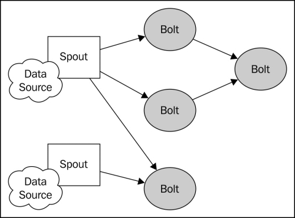
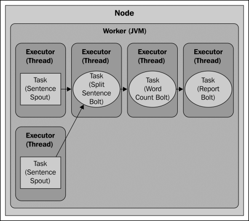
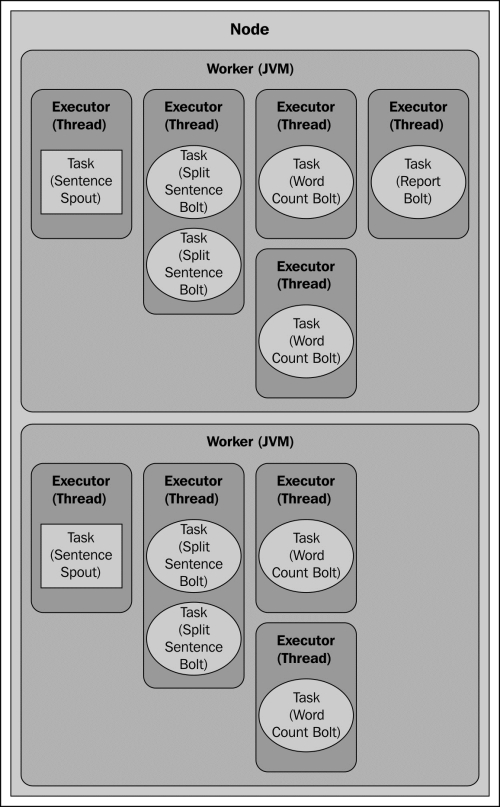
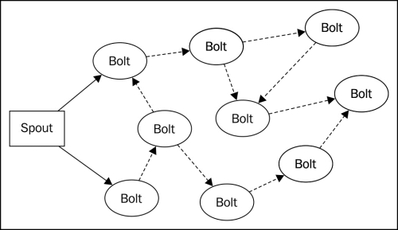

# 第一章 分布式单词计数
本章，主要介绍使用storm开发分布式流处理应用的基本概念。我们将构建一个统计持续流动的句子中单词个数的简单应用。通过本章的学习，你将了解到设计一个复杂流计算系统所学需要的多种结构，技术和模式。

我们将首先介绍Storm的数据结构，接下来实现一个完全成熟的Storm应用的各个组件。本章结束,你将基本了解Storm计算结构,搭建开发环境,掌握开发和调试storm应用程序的基本技术。

本章包括以下主题:  
·Storm的基本结构——topologies, streams, spouts, and bolts  
·建立Storm的开发环境  
·实现一个基本的单词计数应用程序  
·并行化和容错  
·并行计算任务扩展  

###介绍的Storm拓扑的基本元素——streams, spouts, and bolts

在Storm中,分布式计算的结构被称为一个拓扑，它由流数据,Spouts(流生产者),以及Bolt(操作)组成。Storm拓扑大致类似于批处理作业，例如Hadoop处理系统等。然而,批作业都清楚定义了任务开始和结束点,Strom拓扑确一直运行下去,直到显式地kill或解除部署。

####Streams

Storm的核心数据结构是元组。元组是一个简单的命名值列表(键-值对),流是一个无界元组序列。如果你熟悉复杂事件处理(CEP),你可以把Storm元组看作是事件。

####Spouts

Spout是storm拓扑的主要数据入口点。Spout像适配器一样连接到一个源的数据,将数据转换为元组,发然后发射出一连串的元组。

正如您了解的,Storm提供了一个简单的API实现Spout。开发一个Spout主要是编写代码从原始源或API消费数据。主要的数据来源包括:  
·web网站或移动应用程序的点击流    
·Twitter或其他社交网络输入  
·传感器输出  
·应用程序日志事件  

因为Spout通常不实现任何特定的业务逻辑,他们常常可以被多个拓扑重用。

####Bolts

Bolts可以被认为是运算操作或函数。它可以任意数量的流作为输入,处理数据,并可选地发出一个或多个流。Bolt可以从Spout或其他bolt订阅流,使它可以形成一个复杂的网络流的转换。

像Spout API一样，Bolts可以执行任何形式的处理,而且bolt的接口简单直接。典型的Bolt执行的功能包括:  
·过滤元组  
·连接和聚合  
·计算  
·数据库读/写  

###介绍的单词计数拓扑数据流

我们的单词计数拓扑(下图中所示)将由一个Spout接着三个bolt组成。
 

####Sentence spout

SentenceSpout类只会发出一连串的单值元组，名字为“sentence”和一个字符串值(一个句子),像下面的代码:

    { "sentence":"my dog has fleas" }

为简单起见,我们的数据的来源将是一个不变的句子列表，我们遍历这些句子,发射出每个句子的元组。在真实的应用程序中,一个Spout通常连接到一个动态数据源,如从Twitter API查询得到的微博。

####分词bolt

分割句子bolt将订阅句子spout的元组流。对收到的每个元组,它将查找“句子”对象的值,然后分割成单词,每个单词发射出一个元组:

    { "word" : "my" }
    { "word" : "dog" }
    { "word" : "has" }
    { "word" : "fleas" }

####单词统计bolt

单词统计Spout订阅SplitSentenceBolt类的输出,持续对它收到的特定词记数。每当它收到元组,它将增加与单词相关联计数器,并发出当前这个词和当前记数:

    { "word" : "dog", "count" : 5 }

####报告 bolt

该报告bolt订阅WordCountBolt类的输出并维护一个表包含所有单词和相应的数量,就像WordCountBolt一样。当它收到一个元组,它更新表并将内容打印到控制台。

###实现单词统计拓扑

前面我们已经介绍了基本的Storm概念,接下来我们将开发一个简单的应用程序。现在,我们在本地模式下开发和运行Storm拓扑。Storm的本地模式是在一个JVM实例中模拟Storm集群,便于在本地开发环境或IDE中开发和调试Storm拓扑。在后面的章节中,我们将向您展示如何在本地模式下开发Storm拓扑并部署到完全分布式集群环境中。

####建立开发环境

创建一个新的Storm项目只是把Storm库和其依赖添加到Java类路径中。然而,当您将学完第二章--storm集群配置,你可将Strom拓扑和你编译环境需要特殊的包部署到集群中。因此,强烈建议您使用一个构建管理工具,比如Apache Maven，Gradle或Leinengen。在分布式单词记数的例子中,我们将使用Maven。

首先我们创建一个maven项目:

    $ mvn archetype:create -DgroupId=storm.blueprints
    -DartifactId=Chapter1
    -DpackageName=storm.blueprints.chapter1.v1

接下来, 编辑pom.xml文件并添加Storm依赖:

    <dependency>
    <groupId>org.apache.storm</groupId>
    <artifactId>storm-core</artifactId>
    <version>0.9.1-incubating</version>
    </dependency>

然后,使用以下命令通过构建项目测试Maven配置:

    $ mvn install

####注意
####下载示例代码

如果你已经购买Packt的书，您可以使用你的账户从http://www.packtpub.com 下载所有中示例代码文件。如果你在其他地方买的这本书,你可以访问http://www.packtpub.com/并注册，会把文件直接邮件给你。

Maven将下载Storm及其所有依赖项。项目已经建立,我们现在就开始写我们的Storm应用程序。

####实现sentence spout

To keep things simple, our SentenceSpout implementation will simulate a
data source by creating a static list of sentences that gets iterated. Each
sentence is emitted as a single field tuple. The complete spout implementation
is listed in Example 1.1.

为简单起见,我们的SentenceSpout实现模拟数据源创建一个静态的句子迭代列表。每一个发出句子作为一个元组。例子1.1给出完整的Spout实现。

#####Example 1.1: SentenceSpout.java

    public class SentenceSpout extends BaseRichSpout {
        private SpoutOutputCollector collector;
        private String[] sentences = {
            "my dog has fleas",
            "i like cold beverages",
            "the dog ate my homework",
            "don't have a cow man",
            "i don't think i like fleas"
        };
        private int index = 0;

        public void declareOutputFields(OutputFieldsDeclarer declarer) {
            declarer.declare(new Fields("sentence"));
        }

        public void open(Map config, TopologyContext
                context, SpoutOutputCollector collector) {
            this.collector = collector;
        }
        public void nextTuple() {
            this.collector.emit(new Values(sentences[index]));
            index++;
            if (index >= sentences.length) {
                index = 0;
            }
            Utils.sleep(1);
        }
    }

BaseRichSpout类是一个方便的类，它实现了ISpout和IComponent接口并提供默认的在本例中我们不需要的方法。使用这个类，我们需只专注于我们所需要的方法。

declareOutputFields()方法是Storm IComponent接口中定义的接口，所有的Storm组件(包括Spout和bolt)必须实现该方法,它用于告诉Storm流组件将会发出的每个流的元组将包含的字段。在这种情况下,我们定义的spout将发射一个包含一个字段(“sentence”)的单一(默认)的元组流。

open()方法中是ISpout中定义的接口，在Spout组件初始化时被调用。open()方法接受三个参数:一个包含Storm配置的Map,一个TopologyContext对象,它提供了关于组件在一个拓扑中的上下文信息,和SpoutOutputCollector对象提供发射元组的方法。在这个例子中,我们不需要执行初始化,因此,open()实现简单的存储在一个实例变量the SpoutOutputCollector对象的引用。

nextTuple()方法是任何Spout实现的核心。Storm调用这个方法来请求Spout OutputCollector来发出输出元组。在这里,我们只是发出句子的当前索引并增加该索引。

####实现split sentence bolt

The SplitSentenceBolt 的实现见Example 1.2.

##### Example 1.2 – SplitSentenceBolt.java

    public class SplitSentenceBolt extends BaseRichBolt {
        private OutputCollector collector;
        public void prepare(Map config, TopologyContext
                context, OutputCollector collector) {
            this.collector = collector;
        }
    
        public void execute(Tuple tuple) {
            String sentence = tuple.getStringByField("sentence");
            String[] words = sentence.split(" ");
            for(String word : words){
                this.collector.emit(new Values(word));
            }
        }
        public void declareOutputFields(OutputFieldsDeclarer declarer) {
            declarer.declare(new Fields("word"));
        }
    }

BaseRichBolt类是另一个便利类，它实现IComponent和IBolt接口。扩展这个类使我们不必实现我们不关心的方法,让我们专注于我们所需要的功能。

IBolt接口中的prepare()方法类似于ISpout 的open()方法。这里一般完成在blot的初始化时的资源初始化,比如数据库连接。像SentenceSpout类一样,SplitSentenceBolt类不需要太多的初始化,所以prepare()方法只保存OutputCollector对象的引用。

在declareOutputFields()方法中,SplitSentenceBolt类定义一个元组流,每个包含一个字段(“word”)。

SplitSentenceBolt核心功能是在类IBolt定义execute()方法。调用此方法每次Bolt从流接收一个订阅的元组。在这种情况下,它在收到的元组中查找“sentence”的值,并将该值拆分成单个的词,然后按单词发出新的tuple。

####实现word count bolt

WordCountBolt类(Example 1.3)是拓扑组件,实际上是维护了单词数。在bolt的prepare()方法中,我们实例化一个实例HashMap<String,Long>,将存储所有单词和相应的数量。最常见的做法在prepare（）方法中来实例化实例变量的。这种模式背后的原因在于部署拓扑时,其组件spout和bolt是在网络上发送的序列化的实例变量。如果spout或bolt有任何non-serializable实例变量在序列化之前被实例化(例如,在构造函数中创建)将抛出NotSerializableException并且拓扑将无法发布。在这种情况下,因为HashMap <String,Long>是可序列化的,我们可以安全地在构造函数中实例化它。然而,一般来说,最好是限制构造函数参数为原始和可序列化的对象，如果是non-serializable对象，则应在prepare()方法中实例化。

在declareOutputFields()方法,WordCountBolt类声明一个元组的流,将包含收到这个词和相应的计数。在execute()方法中,我们查找的收到的单词的计数(如果不存在，初始化为0)，然后增加计数并存储,发出一个新的词和当前计数组成的二元组。发射计数作为流允许拓扑的其他bolt订阅和执行额外的处理。

#####Example 1.3 –WordCountBolt.java

    public class WordCountBolt extends BaseRichBolt {
        private OutputCollector collector;
        private HashMap<String, Long> counts = null;
        public void prepare(Map config, TopologyContext
                context, OutputCollector collector) {
            this.collector = collector;
            this.counts = new HashMap<String, Long>();
        }
    
        public void execute(Tuple tuple) {
            String word = tuple.getStringByField("word");
            Long count = this.counts.get(word);
            if(count == null){
                count = 0L;
            }
            count++;
            this.counts.put(word, count);
            this.collector.emit(new Values(word, count));
        }
    
        public void declareOutputFields(OutputFieldsDeclarer declarer) {
            declarer.declare(new Fields("word", "count"));
        }
    }

####实现report bolt

ReportBolt类的目的是产生每个单词的报告。像WordCountBolt类一样,它使用一个HashMap<Stirng,Long>对象来记录数量,但在这种情况下,它只是存储收到counter bolt的数字。

到目前为止，report bolt与其他bolt之间的一个区别它是一个终止bolt，它只接收元组。因为它不会发出任何流,所以declareOutputFields()方法是空的。

report bolt也介实现了了IBolt中定义的接口cleanup()方法。Storm在bolt即将关闭时调用这个方法。我们利用cleanup()方法以一个方便的方式在拓扑关闭时输出最后计数。但通常情况下,cleanup()方法用于释放资源的bolt,如打开的文件或数据库连接。

一个重要的事情一定要记住关于IBolt.cleanup()方法是没有保证的，当Storm拓扑在当一个集群上运行。在下一行我们谈论Storm的容错机制我们将讨论背后的原因。但是对于本例,我们在开发模式下运行cleanup()方法是保证运行的。

ReportBolt类的完整源代码见Example 1.4.

####Example 1.4 – ReportBolt.java

    public class ReportBolt extends BaseRichBolt {
        private HashMap<String, Long> counts = null;
    
        public void prepare(Map config, TopologyContext context, OutputCollector collector) {
            this.counts = new HashMap<String, Long>();
        }
        public void execute(Tuple tuple) {
            String word = tuple.getStringByField("word");
            Long count = tuple.getLongByField("count");
            this.counts.put(word, count);
        }
    
        public void declareOutputFields(OutputFieldsDeclarer declarer) {
           // this bolt does not emit anything
        }
    
        public void cleanup() {
            System.out.println("--- FINAL COUNTS ---");
            List<String> keys = new ArrayList<String>();
            keys.addAll(this.counts.keySet());
            Collections.sort(keys);
            for (String key : keys) {
                System.out.println(key + " : " + this.counts.get(key));
            }
            System.out.println("--------------");
        }
    
    }

####实现word count topology

既然我们已经定义了Spout和botl完成我们的计算,我们准备集成在一起成形成一个可运行拓扑(参考Example
1.5)。

#####Example 1.5 –WordCountTopology.java

    public class WordCountTopology {
    
        private static final String SENTENCE_SPOUT_ID = "sentence-spout";
        private static final String SPLIT_BOLT_ID = "split-bolt";
        private static final String COUNT_BOLT_ID = "count-bolt";
        private static final String REPORT_BOLT_ID = "report-bolt";
        private static final String TOPOLOGY_NAME = "word-count-topology";
    
        public static void main(String[] args) throws
                Exception {
            SentenceSpout spout = new SentenceSpout();
            SplitSentenceBolt splitBolt = new
                    SplitSentenceBolt();
            WordCountBolt countBolt = new WordCountBolt();
            ReportBolt reportBolt = new ReportBolt();
    
            TopologyBuilder builder = new TopologyBuilder();
            builder.setSpout(SENTENCE_SPOUT_ID, spout);
            // SentenceSpout --> SplitSentenceBolt
            builder.setBolt(SPLIT_BOLT_ID, splitBolt).shuffleGrouping(SENTENCE_SPOUT_ID);
            // SplitSentenceBolt --> WordCountBolt
            builder.setBolt(COUNT_BOLT_ID, countBolt).fieldsGrouping(
                    SPLIT_BOLT_ID, new Fields("word"));
            // WordCountBolt --> ReportBolt
            builder.setBolt(REPORT_BOLT_ID, reportBolt).globalGrouping(COUNT_BOLT_ID);
            Config config = new Config();
            LocalCluster cluster = new LocalCluster();
            cluster.submitTopology(TOPOLOGY_NAME, config,
                    builder.createTopology());
            Utils.sleep(10000);
            cluster.killTopology(TOPOLOGY_NAME);
            cluster.shutdown();
        }
    }

Storm拓扑通常在Java main()方法定义和运行(或提交如果拓扑被部署到集群)。在这个例子中,我们首先定义字符串常量,这将作为我们的唯一标识Storm组件。在main()方法开始实例化我们的spout和bolts并创建了一个TopologyBuilder实例。TopologyBuilder类提供了流-style API定义组件之间的数据流的拓扑。我们注册这个sentence spout并给它分配一个惟一的ID:

    builder.setSpout(SENTENCE_SPOUT_ID, spout);

下一步是注册SplitSentenceBolt并建立一个订阅SentenceSpout发出的流类:
    
    builder.setBolt(SPLIT_BOLT_ID, splitBolt).shuffleGrouping(SENTENCE_SPOUT_ID);

setBolt()方法会注册一个bolt给TopologyBuilder类并返回一个实例BoltDeclarer，它为bolt暴露了定义输入源方法。这里我们通过定义的shuffleGrouping()方法为SentenceSpout和惟一的ID对象建立关系。shuffleGrouping()方法告诉Storm 混排SentenceSpout类发出的元组和均匀分发它们给SplitSentenceBolt对象的之一实例。我们稍后将详细解释流分组并讨论Storm的并行性。

下一行建立SplitSentenceBolt类和theWordCountBolt类之间的连接:

    builder.setBolt(COUNT_BOLT_ID, countBolt).fieldsGrouping(
        SPLIT_BOLT_ID, new Fields("word"));

您将了解,有些时候包含某些数据的元组必须路由到一个特定的实例。在这里,我们使用BoltDeclarer类的fieldsGrouping ()方法,以确保所有元组包含相同的“单词”值路由到同一个WordCountBolt实例。

最后一步，我们把WordCountBolt实例定义的数据流的元组发到ReportBolt类实的例。在这种情况下,我们希望WordCountBolt发出的所有元组路由到一个ReportBolt的任务。这种行为由globalGrouping()方法完成,如下:
    
    builder.setBolt(REPORT_BOLT_ID, reportBolt).globalGrouping(COUNT_BOLT_ID);

与我们的数据流定义一样,运行我们的单词计算的最后一步是建立拓扑,并提交到集群中:

    Config config = new Config();
    LocalCluster cluster = new LocalCluster();
    cluster.submitTopology(TOPOLOGY_NAME, config,
            builder.createTopology());
    Utils.sleep(10000);
    cluster.killTopology(TOPOLOGY_NAME);
    cluster.shutdown();

这里,我们在本地模式下运行Storm，在我们本地开发环境使用Storm LocalCluster类来模拟一个完整的Storm集群。storm本地模式是一种方便的方式来开发和测试应用程序，在部署到分布式集群前。本地模式还允许您在IDE内运行Storm拓扑,设置断点,暂停执行,检查变量和分析应用程序找出性能瓶颈，这些是Storm集群说做不到的。

在本例中,我们创建一个LocalCluster实例并调用具有拓扑名称的submitTopology()方法,它是backtype.storm.Config实例。TopologyBuilder类的createTopology()方法返回的Topology对象。在下一章，您将看到submitTopology()方法用于在本地部署拓扑模式相同的签名方法也可在部署拓扑到远程(分布式)模式。

Storm的Config类仅仅是HashMap<String，Object>的之列,它定义了一系列配置Storm拓扑的运行时行为具体常量和方便的方法。当提交一个拓扑时,Storm将合并其预定义的默认配置值和Congif实例的内容传递给submitTopology()方法,并将结果分别传递给拓扑的spout的open()和bolt的prepare()方法。在这个意义上,配置参数的配置对象表示一组全局拓扑中的所有组件。

我们现在将好运行WordCountTopology类。main()方法将提交拓扑,等待它运行十秒后,杀死(取消)拓扑,最后关闭本地集群。当程序运行完成后,您应该在控制台看到输出类似如下信息:

    --- FINAL COUNTS ---
    a : 1426
    ate : 1426
    beverages : 1426
    cold : 1426
    cow : 1426
    dog : 2852
    don't : 2851
    fleas : 2851
    has : 1426
    have : 1426
    homework : 1426
    i : 4276
    like : 2851
    man : 1426
    my : 2852
    the : 1426
    think : 1425
    --------------

###Storm并行度

前面介绍到,Storm允许计算水平扩展到多台机器,将计算划分为多个独立的任务在集群上并行执行。在风暴中,任务只是在集群中运行的一个Spout的bolt实例。

理解并行性是如何工作的,我们必须首先解释一个Stormn集群拓扑参与执行的四个主要组件:
·Nodes(机器):这些只是配置为Storm集群参与执行拓扑的部分的机器。Storm集群包含一个或多个节点来完成工作。
·Workers(JVM):这些是在一个节点上运行独立的JVM进程。每个节点配置一个或更多运行的worker。一个拓扑可以请求一个或更多的worker分配给它。
·Executors(线程):这些是worker运行在JVM进程一个Java线程。多个任务可以分配给一个Executor。除非显式重写,Storm将分配一个任务给一个Executor。
·Tasks(Spout/Bolt实例):任务是Spout和bolt的实例，在executor线程中运行nextTuple()和executre()方法。

####WordCountTopology并行性

到目前为止,在我们的单词计数的例子中,我们没有显式地使用任何Storm的并行api;相反,我们允许Storm使用其默认设置。在大多数情况下,除非覆盖,Storm将默认使用最大并行性设置。

改变拓扑结构的并行设置之前,让我们考虑拓扑在默认设置下是如何将执行的。假设我们有一台机器(节点),指定一个worker的拓扑,并允许Storm每一个任务一个executor执行,执行我们的拓扑，将会如下:

正如您可以看到的,并行性只有线程级别。每个任务运行在一个JVM的一个单独的线程内。我们怎样才能利用我们手头的硬件更有效地提高并行性?让我们开始通过增加worker和executors的数量来运行我们的拓扑。

####在拓扑中增加worker

分配额外的worker是一个增加拓扑计算能力的一种简单方法,Storm提供了通过其API或纯粹配置来更改这两种方式。无论我们选择哪一种方法,我们的组件上Spout的和bolt没有改变,并且可以重复使用。

以前版本的字数统计拓扑中,我们介绍了配置对象,在部署时传递到submitTopology()方法,但它基本上未使用。增加分配给一个拓扑中worker的数量,我们只是调用Config对象的setNumWorkers()方法:
    
    Config config = new Config();
    config.setNumWorkers(2);

这个分配两个Worker的拓扑结构而不是默认的。这将计算资源添加到我们的拓扑中,为了有效地利用这些资源,我们也会想调整executors的数量和我们的拓扑每个executor的task数量。

####配置executor数和task数

正如我们所看到的,默认情况下，在一个拓扑定义时Storm为每个组件创建一个单一的任务,为每个任务分配一个executor。Storm的并行API提供了修改这种行为的方式,允许您设置的每个任务的executor数和每个exexutor的task数量。

executor的数量分配到一个给定的组件是通过修改配置当定义一个流分组并行性时。为了说明这个特性,让我们
修改我们的拓扑SentenceSpout并行度分配两个任务,每个任务分配自己的executor线程:

    builder.setSpout(SENTENCE_SPOUT_ID, spout, 2);

如果我们使用一个worker,执行我们的拓扑现在看起来像下面的样子:

接下来,我们将设置分割句子bolt为两个有四个task的executor执行。每个executor线程将被指派两个任务执行(4 / 2 = 2)。我们还将配置字数统计bolt运行四个任务,每个都有自己的执行线程:

    builder.setBolt(SPLIT_BOLT_ID, splitBolt, 2).setNumTasks(4)
        .shuffleGrouping(SENTENCE_SPOUT_ID);
    builder.setBolt(COUNT_BOLT_ID, countBolt, 4)
        .fieldsGrouping(SPLIT_BOLT_ID, newFields("word"));

有两个worker,拓扑的执行将看起来像下面的图:

拓扑结构的并行性增加,运行更新的WordCountTopology类为每个单词产生了更高的总数量:

    --- FINAL COUNTS ---
    a : 2726
    ate : 2722
    beverages : 2723
    cold : 2723
    cow : 2726
    dog : 5445
    don't : 5444
    fleas : 5451
    has : 2723
    have : 2722
    homework : 2722
    i : 8175
    like : 5449
    man : 2722
    my : 5445
    the : 2727
    think : 2722
    --------------

因为Spout无限发出数据,直到topology被kill,实际的数量将取决于您的计算机的速度和其他什么进程运行它,但是你应该看到一个总体增加的发射和处理数量。

重要的是要指出,增加woker的数量并不会影响一个拓扑在本地模式下运行。一个拓扑在本地模式下运行总是运行在一个单独的JVM进程,所以只有任务和executro并行设置才会有影响。Storm的本地模式提供一个近似的集群行为在你测试在一个真正的应用程序集群生产环境之前对开发是很有用的。

###Storm流分组

基于前面的例子,你可能想知道为什么我们不增加ReportBolt的并行性?答案是,它没有任何意义。要理解为什么,你需要理解Storm流分组的概念。

流分组定义了在一个拓扑中一个流的元组是如何分布在bolt的任务的。例如,在并行版本的字数统计拓扑,在拓扑的SplitSentenceBolt类被分配了四个任务。流分组决定哪一个任务将获得哪一个给定的元组。

Storm定义了7个内置流分组:
·随机分组:随机分配整个目标bolt的任务,这样每个元组bolt接收同等数量的元组。
·字段分组:该元组基于分组字段中指定的值路由bolt任务。例如,如果一个流组合“word”字段,“word”相同的元组值字段将总是被路由到相同的bolt的任务。
·All分组:这复制bolt任务所有的元组,每个任务将获得元组的一个副本。
·Global分组:这个把所有元组路由到一个任务中,选择最低的任务任务ID值。注意,设置bolt的并行性或任务的数量在使用全球分组是没有意义的,因为所有元组将被路由到相同的bolt的任务。Global分组应谨慎使用,因为它将所有元组路由到一个JVM实例,可能造成在特定JVM/机器在一个集群中形成拥塞。
· None分组:None分组的功能相当于随机分组。它被保留以供将来使用。
·直接分组:直接分组,源决定哪个组件将接收一个给定的元组通过调用emitDirect()方法。它只能用于定义直接流。
· Local or shuffle grouping: 本地或随机分组类似于随机分组,但把元组shuffle到bolt任务运行在相同的工作进程中,如果可以。否则,它将退回到随机分组的行为。根据拓扑结构的并行性,本地或随机分组可以通过限制网络提高拓扑传输性能。

除了预定义的分组,您可以定义您自己的流分组通过实现CustomStreamGrouping接口:

    public interface CustomStreamGrouping extends Serializable {
        void prepare(WorkerTopologyContext context, GlobalStreamId stream, List<Integer> targetTasks);
        List<Integer> chooseTasks(int taskId, List<Object> values);
    }

prepare()方法在运行时被调用，它初始化分组信息分组的实现可以使用它来决定元组元组怎样被任务说接受。WorkerTopologyContext对象提供关于拓扑的上下文信息,和GlobalStreamId对象提供元数据流
分组。最有用的参数是targetTasks,它是分组需要考虑所有任务标识符列表。你通常会将targetTasksparameter作为一个实例变量引用存储在chooseTasks()方法的实现中。

chooseTasks()方法返回一个应发送的元组任务标识符列表的。它的参数是发出元组组件的任务标识符和元组的值。

为了说明流分组的重要性,让我们引入一个错误拓扑。先修改SentenceSpout 的nextTuple()方法,它只发出每个句子一次:

    public void nextTuple() {
        if(index < sentences.length){
            this.collector.emit(new Values(sentences[index]));
            index++;
        }
        Utils.waitForMillis(1);
    }

现在运行拓扑得到以下输出:

    --- FINAL COUNTS ---
    a : 2
    ate : 2
    beverages : 2
    cold : 2
    cow : 2
    dog : 4
    don't : 4
    fleas : 4
    has : 2
    have : 2
    homework : 2
    i : 6
    like : 4
    man : 2
    my : 4
    the : 2
    think : 2
    --------------

现在修改CountBolt的field分组为参数随机分组并重新运行拓扑:

    builder.setBolt(COUNT_BOLT_ID, countBolt, 4)
        .shuffleGrouping(SPLIT_BOLT_ID);

输出应该类似于下面:

    --- FINAL COUNTS ---
    a : 1
    ate : 2
    beverages : 1
    cold : 1
    cow : 1
    dog : 2
    don't : 2
    fleas : 1
    has : 1
    have : 1
    homework : 1
    i : 3
    like : 1
    man : 1
    my : 1
    the : 1
    think : 1
    --------------

我们计算不正确了,因为CountBolt参数是有状态:它保留一个计数为每个收到的单词的。在这种情况下,我们计算的准确性取决于当组件被并行化基于元组的内容分组的能力。引入的错误我们将只显示如果CountBolt参数大于1的并行性。这强调了测试拓扑与各种并行配置的重要性。

####Tip

一般来说,你应该避免将状态信息存储在一个bolt因为任何时间worker或有其任务重新分配失败,该信息将丢失。一个解决方案是定期快照的持久性存储状态信息,比如数据库,所以它可以恢复是否重新分配一个任务。

###消息处理保证

Storm提供一个API,允许您保证Spout发出的一个元组被完全处理。到目前为止,在我们的示例中,我们不担心失败。我们已经看到,Spout流可以分裂和可以生成任意数量的流拓扑结构,根据下bolt的行为。在发生故障时,会发生什么呢?作为一个例子,考虑一个bolt持久化元组数据信息基于数据库。我们该如何处理数据库更新失败的情况呢?

####Spout的可靠性

在Storm中,保证消息处理从Spout开始。Spout支持保证处理需要一种方法来跟踪发出的元组,如果下游处理完元组则回发一个元组,或任何元组失败。子元组可以被认为是任何来自Spout元组的结果元组。看的另一种方法是考虑Spout流(作为一个元组树的树干(下图所示):

在前面的图中,实线代表原树干spoout发出的元组,虚线代表来自最初的元组的元组。结果图代表元组树。保证处理,树中的每个bolt可以确认(ack)或fail一个元组。如果所有bolt在树上ack元组来自主干tuple,spout的ack方法将调用表明消息处理完成。如果任何bolt在树上明确fail一个元组,或如果处理元组树超过了超时时间,spout的fail方法将被调用。

Storm的ISpout接口定义了涉及可靠性的三个方法API:nextTuple,ack,fail。

    public interface ISpout extends Serializable {
        void open(Map conf, TopologyContext context, SpoutOutputCollector collector);
    
        void close();
        void nextTuple();
        void ack(Object msgId);
        void fail(Object msgId);
    }

正如我们所见过的,当Storm要求spout发出一个元组,它调用nextTuple()方法。实现保证处理的第一步是保证元组分配一个惟一的ID并将该值传递给SpoutOutputCollector的emit()方法：

    collector.emit(new Values("value1", "value2") ,msgId);

分配tuple消息ID告诉Storm,Spout想接收通知或元组树完成时如果不能在任何时候如果处理成功,Spout的ack()方法将被调用的消息ID分配给元组。如果处理失败或超时,Spout的失败方法将被调用。

####bolt可靠性

实现一个bolt,保证消息处理涉及两个步骤:
1。锚定发射传入的元组当发射新的元组时。
2。确认或失败

锚定一个元组意味着我们创造一个传入的元组和派生的元组之间的联系,这样任何下游bolt预计参与的元组树确认tuple,或让元组失败,或让它超时。

你可以锚定一个元组(或元组的列表)通过调用OutputCollector重载方法之一emit:

    collector.emit(tuple, new Values(word));

在这里,我们锚定传入的元组并发射一个新的元组,下游bolt应该确认或失败。另一种形式的emit方法将发出所属的元组:

    collector.emit(new Values(word));

未锚定的元组不参与一个流的可靠性保证。如果一个非锚点元组下游失败,它不会导致原始根元组的重发。

成功处理元组后选择发射新的或派生的元组,一个bolt处理可靠流应该确认输入的元组:

    this.collector.ack(tuple);

如果元组处理失败，这种情况下，spout必须重发(再)元组,bolt应明确失败的元组:

    this.collector.fail(tuple)

如果元组由于超时或通过一个显式的调用处理OutputCollector.fail()方法失败,Spout,最初的元组,发出通知,让它重发tuple,您在稍后就会看到。

####可靠的word count

为了进一步说明可靠性,我们首先加强SentenceSpout类支持保证可靠。它将需要跟踪所有发出的元组并分配每一个惟一的ID,我们将使用一个HashMap < UUID、Values>对象来存储未处理完的元组。对于我们发出的每个元组,我们会分配一个唯一的标识符,并将其存储在我们的未处理完map。当我们收到一个消息的确认,我们将从我们的等待名单删除元组。失败,我们将重复该元组:

    public class SentenceSpout extends BaseRichSpout {
    
        private ConcurrentHashMap<UUID, Values> pending;
    
        private SpoutOutputCollector collector;
    
        private String[] sentences = {
                "my dog has fleas",
                "i like cold beverages",
                "the dog ate my homework",
                "don't have a cow man",
                "i don't think i like fleas"
        };
        private int index = 0;
    
        public void declareOutputFields(OutputFieldsDeclarer declarer) {
            declarer.declare(new Fields("sentence"));
        }
        public void open(Map config, TopologyContext context,
                         SpoutOutputCollector collector) {
            this.collector = collector;
            this.pending = new ConcurrentHashMap<UUID, Values>();
        }
    
        public void nextTuple() {
            Values values = new Values(sentences[index]);
            UUID msgId = UUID.randomUUID();
            this.pending.put(msgId, values);
            this.collector.emit(values, msgId);
            index++;
            if (index >= sentences.length) {
                index = 0;
            }
            Utils.sleep(1);
        }
        public void ack(Object msgId) {
            this.pending.remove(msgId);
        }
    
        public void fail(Object msgId) {
            this.collector.emit(this.pending.get(msgId), msgId);
        }
    }

修改bolt提供保证处理简单涉及锚定出站元组的元组,然后确认收到的元组:

    public class ReliableSplitSentenceBolt extends BaseRichBolt {
        private OutputCollector collector;
        public void prepare(Map config, TopologyContext
                context, OutputCollector collector) {
            this.collector = collector;
        }
    
        public void execute(Tuple tuple) {
            String sentence = tuple.getStringByField("sentence");
            String[] words = sentence.split(" ");
            for(String word : words){
                this.collector.emit(tuple, new Values(word));
            }
            this.collector.ack(tuple);
        }
        public void declareOutputFields(OutputFieldsDeclarer declarer) {
            declarer.declare(new Fields("word"));
        }
    }

###总结

在这一章,我们已经构建了一个简单的分布式计算应用程序使用Stomr的核心API和并覆盖很大一部分Storm的特性集,即使没有安装Storm和部署一个集群。Storm的本地模式是强大的生产力并易于开发,但要想看到Storm的真正的强大和水平可伸缩性，你需要将应用程序部署到一个真正的集群中。

在下一章,我们将介绍安装和设置Storm集群环境的过程并部署一个分布式拓扑环境。