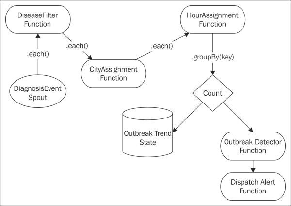

#第三章 Trident拓扑与传感器数据

在这一章,我们将探索Trident拓扑。Trident提供了一个在Storm之上更高级别的抽象。Tridewnt进行了抽象事务处理和状态管理的细节。具体来说,Trident把多个元组组成为为一组离散的事务。此外,Trident提供了抽象,允许对拓扑数据执行功能,过滤和聚合操作。

我们将使用传感器数据作为例子来获得更好的理解Trident。通常,读取传感器数据流形式,从许多不同的地方。一些传统的例子包括天气或交通信息,但该模式包括到广泛的来源。例如,手机上运行的应用程序生成大量的事件信息。处理手机事件流是传感器数据处理的另一个实例。

传感器数据包含了很多设备发出的事件,往往形成一个无休止的流。这是一个完美的Storm的用例。
在这一章,我们将介绍:
· Trident拓扑
· Trident spouts
· Trident操作 – filters and functions
· Trident aggregators – Combiners and Reducers
· Trident状态

##说明我们的例子

为了更好地理解Trident拓扑,以及用Storm处理传感器数据,我们将实现一个Trident拓扑收集医学报告来识别疾病的爆发。

拓扑将处理包含以下的诊断信息事件:

<table>
    <tbody>
       <tr><th><em>Latitude</em></th><th><em>Longitude</em></th><th><em>Timestamp</em></th><th><em>Diagnosis Code (ICD9-CM)</em></th></tr>
       <tr><td>39.9522</td><td>-75.1642</td><td>03/13/2013 at 3:30 PM</td><td>320.0 (Hemophilus meningitis)</td></tr>
       <tr><td>40.3588</td><td>-75.6269</td><td>03/13/2013 at 3:50 PM</td><td>324.0 (Intracranial abscess)</td></tr>
    </tbody>
</table>

每个事件将包括发生的全球定位系统(GPS)的坐标。指定的纬度和经度是十进制格式。事件还包含ICD9-CM代码,代表事件的诊断和一个时间戳。ICD-9-CM代码的完整列表可以在查看:http://www.icd9data.com/ .

为了检测爆发,系统将计算特定疾病编码在一个地理位置在指定的一段时间的出现频次。为了简化这个示例,我们将每个诊断事件映射到最近的城市。在实际的系统中,您很可能会执行更复杂的事件地理空间聚类。

本例中,我们将以来出现的小时分组。在一个真实世界的系统,你最有可能使用滑动窗口来计算移动平均线
趋势。

最后,我们将使用一个简单的阈值,以确定是否有爆发。如果一个小时内的出现数的大于阈值,系统将会发送一个报警并发给国家警卫队。

为了维护历史记录,我们也将持久化对于每一个城市,每小时,每种疾病出现的数量。

##Trident拓扑

为了满足这些需求,我们将需要一个统计出现次数拓扑。这可能是一个挑战,而使用标准Storm拓扑因为元组可以重播,导致重复计算。正如我们在接下来的几节中看到的,Trident提供原语来解决这个问题。

我们将使用拓扑如下:

前面拓扑的代码如下:

    public class OutbreakDetectionTopology {
        public static StormTopology buildTopology() {
            TridentTopology topology = new TridentTopology();
            DiagnosisEventSpout spout = new DiagnosisEventSpout();
            Stream inputStream = topology.newStream("event",spout);

            // Filter for critical events.
            inputStream.each(new Fields("event"), new DiseaseFilter()))
            // Locate the closest city
            .each(new Fields("event"), new CityAssignment(), new Fields("city"))
            // Derive the hour segment
            .each(new Fields("event", "city"), new HourAssignment(), new Fields("hour","cityDiseaseHour"))
            // Group occurrences in same city and hour
            .groupBy(new Fields("cityDiseaseHour"))
            // Count occurrences and persist the results.
            .persistentAggregate(new OutbreakTrendFactory(), new Count(), new Fields("count"))
            .newValuesStream()
            // Detect an outbreak
            .each(new Fields("cityDiseaseHour","count"), new OutbreakDetector(), new Fields("alert"))
            // Dispatch the alert
            .each(new Fields("alert"), new DispatchAlert(), new Fields());
        }
    }

前面的代码显示了不同的Trident函数之间的连接。首先,DiagnosisEventSpout函数发出事件。事件然后由DiseaseFilter函数过滤,它过滤掉出现的我们不关心的疾病,。在那之后,CityAssignmentfunction使事件与城市相关联。然后,HourAssignment函数分配一小时事件添加一个元组的可以,它包括城市,小时,和疾病的代码。然后我们按这个关键分组,使计数的并持久化这些计数在拓扑persistAggregatefunction一步。然后把计数传递到OutbreakDetectorfunction进行阈值计算,超过阈值时发出警报。最后,DispatchAlert函数接收警报，产生日志消息,并终止程序。在下一节中,我们将深入学习每一个步骤。
