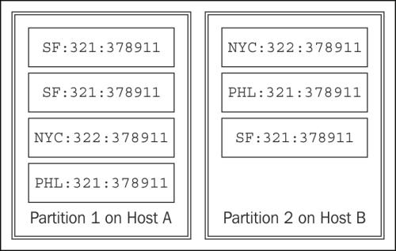
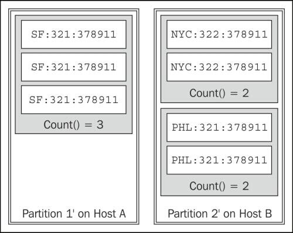

#第三章 Trident拓扑与传感器数据

在这一章,我们将探索Trident拓扑。Trident提供了一个在Storm之上更高级别的抽象。Tridewnt进行了抽象事务处理和状态管理的细节。具体来说,Trident把多个元组组成为为一组离散的事务。此外,Trident提供了抽象,允许对拓扑数据执行功能,过滤和聚合操作。

我们将使用传感器数据作为例子来获得更好的理解Trident。通常,读取传感器数据流形式,从许多不同的地方。一些传统的例子包括天气或交通信息,但该模式包括到广泛的来源。例如,手机上运行的应用程序生成大量的事件信息。处理手机事件流是传感器数据处理的另一个实例。

传感器数据包含了很多设备发出的事件,往往形成一个无休止的流。这是一个完美的Storm的用例。
在这一章,我们将介绍:
· Trident拓扑
· Trident spouts
· Trident操作 – filters and functions
· Trident aggregators – Combiners and Reducers
· Trident状态

##说明我们的例子

为了更好地理解Trident拓扑,以及用Storm处理传感器数据,我们将实现一个Trident拓扑收集医学报告来识别疾病的爆发。

拓扑将处理包含以下的诊断信息事件:

<table>
    <tbody>
       <tr><th><em>Latitude</em></th><th><em>Longitude</em></th><th><em>Timestamp</em></th><th><em>Diagnosis Code (ICD9-CM)</em></th></tr>
       <tr><td>39.9522</td><td>-75.1642</td><td>03/13/2013 at 3:30 PM</td><td>320.0 (Hemophilus meningitis)</td></tr>
       <tr><td>40.3588</td><td>-75.6269</td><td>03/13/2013 at 3:50 PM</td><td>324.0 (Intracranial abscess)</td></tr>
    </tbody>
</table>

每个事件将包括发生的全球定位系统(GPS)的坐标。指定的纬度和经度是十进制格式。事件还包含ICD9-CM代码,代表事件的诊断和一个时间戳。ICD-9-CM代码的完整列表可以在查看:http://www.icd9data.com/ .

为了检测爆发,系统将计算特定疾病编码在一个地理位置在指定的一段时间的出现频次。为了简化这个示例,我们将每个诊断事件映射到最近的城市。在实际的系统中,您很可能会执行更复杂的事件地理空间聚类。

本例中,我们将以来出现的小时分组。在一个真实世界的系统,你最有可能使用滑动窗口来计算移动平均线
趋势。

最后,我们将使用一个简单的阈值,以确定是否有爆发。如果一个小时内的出现数的大于阈值,系统将会发送一个报警并发给国家警卫队。

为了维护历史记录,我们也将持久化对于每一个城市,每小时,每种疾病出现的数量。

##Trident拓扑

为了满足这些需求,我们将需要一个统计出现次数拓扑。这可能是一个挑战,而使用标准Storm拓扑因为元组可以重播,导致重复计算。正如我们在接下来的几节中看到的,Trident提供原语来解决这个问题。

我们将使用拓扑如下:

前面拓扑的代码如下:

    public class OutbreakDetectionTopology {
        public static StormTopology buildTopology() {
            TridentTopology topology = new TridentTopology();
            DiagnosisEventSpout spout = new DiagnosisEventSpout();
            Stream inputStream = topology.newStream("event",spout);

            // Filter for critical events.
            inputStream.each(new Fields("event"), new DiseaseFilter()))
            // Locate the closest city
            .each(new Fields("event"), new CityAssignment(), new Fields("city"))
            // Derive the hour segment
            .each(new Fields("event", "city"), new HourAssignment(), new Fields("hour","cityDiseaseHour"))
            // Group occurrences in same city and hour
            .groupBy(new Fields("cityDiseaseHour"))
            // Count occurrences and persist the results.
            .persistentAggregate(new OutbreakTrendFactory(), new Count(), new Fields("count"))
            .newValuesStream()
            // Detect an outbreak
            .each(new Fields("cityDiseaseHour","count"), new OutbreakDetector(), new Fields("alert"))
            // Dispatch the alert
            .each(new Fields("alert"), new DispatchAlert(), new Fields());
        }
    }

前面的代码显示了不同的Trident函数之间的连接。首先,DiagnosisEventSpout函数发出事件。事件然后由DiseaseFilter函数过滤,它过滤掉出现的我们不关心的疾病,。在那之后,CityAssignmentfunction使事件与城市相关联。然后,HourAssignment函数分配一小时事件添加一个元组的可以,它包括城市,小时,和疾病的代码。然后我们按这个关键分组,使计数的并持久化这些计数在拓扑persistAggregatefunction一步。然后把计数传递到OutbreakDetectorfunction进行阈值计算,超过阈值时发出警报。最后,DispatchAlert函数接收警报，产生日志消息,并终止程序。在下一节中,我们将深入学习每一个步骤。

##Trident spouts

让我们先看看拓扑的spout。与Storm相比,Trident引入了批次的概念。不像Storm spout,Trident Spout必须批量发出元组。

每批数据都有自己的唯一事务标识符。一个Spout决定一批数据组成通过基于合同的约束。有三种约定类型的Spout:非事务性、事务型和不透明。

非事务性Spout无法保证批次的构成，消息可能重叠。两个不同批次可能包含相同的元组。事务型Spout不会有重叠,保证同一批次总是包含相同的元组。不透明Spout保证批次非重叠,但同一批可能会改变内容。

如下表中所示:

<table>
    <tbody>
       <tr><th><em>Spout type</em></th><th><em>Batches may overlap</em></th><th><em>Batch contents may change</em></th></tr>
       <tr><td>Non-transactional</td><td>X</td><td>X</td</tr>
       <tr><td>Opaque</td><td>X</td><td></td></tr>
       <tr><td>Transactional</td><td></td><td></td></tr>
    </tbody>
</table>

Spout的接口如下面的代码片段:

    public interface ITridentSpout<T> extends Serializable {
        BatchCoordinator<T> getCoordinator(String txStateId, Map conf,    TopologyContext context);
        Emitter<T> getEmitter(String txStateId, Map conf, TopologyContext context);
        Map getComponentConfiguration();
       Fields getOutputFields();
    }

在Trident中,Spout并不实际发出元组。相反,工作由BatchCoordinator和Emiter来完成。Emitter的功能是负责发射元组,而BatchCoordinator函数负责管理批处理和元数据,这样发射器就能够正确地重放批数据。

TridentSpout函数简单地提供了BatchCoordinator和发射器的访问器方法功能和声明了Spout将发出字段。下面用DiagnosisEventSpout来说明功能:

    public class DiagnosisEventSpout implements ITridentSpout<Long> {
        private static final long serialVersionUID = 1L;
        SpoutOutputCollector collector;
        BatchCoordinator<Long> coordinator = new DefaultCoordinator();
        Emitter<Long> emitter = new DiagnosisEventEmitter();
    
        @Override
        public BatchCoordinator<Long> getCoordinator(
                String txStateId, Map conf, TopologyContext
                context) {
            return coordinator;
        }
    
        @Override
        public Emitter<Long> getEmitter(String txStateId, Map conf, TopologyContext context) {
            return emitter;
        }
    
        @Override
        public Map getComponentConfiguration() {
            return null;
        }
    
        @Override
        public Fields getOutputFields() {
            return new Fields("event");
        }
    }

在我们的示例拓扑中，getOutputFields()方法在前面的代码中,,Spout发出一个称为事件的字段,其中包含DiagnosisEvent类中。

BatchCoordinator类实现以下接口:

    public interface BatchCoordinator<X> {
        X initializeTransaction(long txid, X prevMetadata);
        void success(long txid);
        boolean isReady(long txid);
        void close();
    }

BatchCoordinator类是一个泛型类。泛型类是重播一批所需的元数据。在我们的示例中,Spout发出随机事件,因此元数据将被忽略。然而,在实际的系统中,元数据可能包含组成一批消息的标识符或对象。有了这些信息,不透明和事务性Spout可以遵守合同的内容,并确保批次不重叠,在事务Spout情况下,批处理不改变内容。

BatchCoordinator类在一个Storm bolt单线程中实现了一个操作。Storm持久化元数据在Zookeeper中。当每个事务完成时它通知协调员。

在我们的例子中,如果我们不协调,下面是协调用于DiagnosisEventSpout类:

    public class DefaultCoordinator implements
            ITridentSpout.BatchCoordinator<Long>, Serializable {
        private static final long serialVersionUID = 1L;
        private static final Logger LOG =
                LoggerFactory.getLogger(DefaultCoordinator.class);
    
        @Override
        public boolean isReady(long txid) {
            return true;
        }
    
        @Override
        public void close() {
        }
    
    
        @Override
        public Long initializeTransaction(long txid, Long prevMetadata, Long currMetadata) {
            return null;
        }
    
        @Override
        public void success(long txid) {
            LOG.info("Successful Transaction [" + txid + "]");
        }
    }

在Trident Spout中，第二部分是发射器的功能。发射器功能完成Storm Spout的功能使用收集器发出元组。唯一的区别是,它使用一个TridentCollector类,元组必须包含在一个批处理被BatchCoordinator类初始化。

发射器的接口函数看起来像下面的代码片段:

    public interface Emitter<X> {
        void emitBatch(TransactionAttempt tx, X coordinatorMeta, TridentCollector collector);
        void close();
    }

前面的代码所示,发射器函数只有一个职责——给定批发出的元组。要做到这一点,批处理的功能是传递元数据(这是由协调器),关于事务的信息给收集器,发射器函数使用发出的元组。DiagnosisEventEmitter类的实现如下:

    public class DiagnosisEventEmitter implements
            ITridentSpout.Emitter<Long>, Serializable {
        private static final long serialVersionUID = 1L;
        AtomicInteger successfulTransactions = new AtomicInteger(0);
    
        @Override
        public void emitBatch(TransactionAttempt tx, Long
                coordinatorMeta, TridentCollector collector) {
            for (int i = 0; i < 10000; i++) {
                List<Object> events = new ArrayList<Object>();
                double lat =  new Double(-30 + (int) (Math.random() * 75));
                double lng =  new Double(-120 + (int) (Math.random() * 70));
                long time = System.currentTimeMillis();
                String diag = new Integer(320 + (int) (Math.random() * 7)).toString();
                DiagnosisEvent event = new DiagnosisEvent(lat, lng, time, diag);
                events.add(event);
                collector.emit(events);
            }
        }
    
        @Override
        public void success(TransactionAttempt tx) {
            successfulTransactions.incrementAndGet();
        }
    
        @Override
        public void close() {
        }
    }

在emitBatch()方法中完成我们的工作。对于这个示例,我们将随机分配一个经度和纬度,保持在美国左右
,我们将使用System.currentTimeMillis()方法产生诊断的时间戳。

在现实生活中,ICD-9-CM码分布在范围在000年和999年之间。对于本例,我们将只使用诊断代码在320和327之间。这些代码列出如下:

<table>
    <tbody>
       <tr><th><em>Code</em></th><th><em>Description</em></th></tr>
       <tr><td>320</td><td>Bacterial meningitis</td></tr>
       <tr><td>321</td><td>Meningitis due to other organisms</td></tr>
       <tr><td>322</td><td>Meningitis of unspecified cause</td></tr>
       <tr><td>323</td><td>Encephalitis myelitis and encephalomyelitis</td></tr>
       <tr><td>324</td><td>Intracranial and intraspinal abscess</td></tr>
       <tr><td>325</td><td>Phlebitis and thrombophlebitis of intracranial venous sinuses</td></tr>
       <tr><td>326</td><td>Late effects of intracranial abscess or pyogenic infection</td></tr>
       <tr><td>327</td><td>Organic sleep disorders</td></tr>
    </tbody>
</table>

这些诊断代码之随机分配给一个事件。

在这个例子中,我们将使用一个对象来封装诊断事件。只是为了容易,我们可以发出的每个组件作为一个单独的字段元组。对象封装和使用tuple中的字段之间有一个平衡。通常,这是一个好主意保持字段的数量降低到一个可控制的范围后,但它也包括数据使用的是有意义的控制流和/或分组的字段元组。

在我们的示例中,DiagnosisEvent类是拓扑的关键操作数据。该对象看起来像下面的代码片段:

    public class DiagnosisEvent implements Serializable {
        private static final long serialVersionUID = 1L;
        public double lat;
        public double lng;
        public long time;
        public String diagnosisCode;
    
        public DiagnosisEvent(double lat, double lng,
                              long time, String diagnosisCode) {
            super();
            this.time = time;
            this.lat = lat;
            this.lng = lng;
            this.diagnosisCode = diagnosisCode;
        }
    }

对象是一个简单的JavaBean。时间存储成为一个Long型变量自纪元依赖。纬度和经度都存储为double型。
diagnosisCode存储为一个字符串,以防系统需求能够处理其他类型的代码不基于ICD-9等字母数字代码。

在这一点上,拓扑能够发出事件。在实际实现中,我们可能把拓扑集成到一个医疗索赔处理引擎或电子健康记录系统中。

##Trident操作--filters and functions

现在我们已经产生事件,下一步是添加逻辑组件来实现业务流程。在Trident中，这些被称为操作。在我们的拓扑结构,我们使用两种不同类型的操作:filters和functions。

操作是通过方法应用于流对象。在这个例子中,我们使用以下流对象方法:

    public class Stream implements IAggregatableStream {
        public Stream each(Fields inputFields, Filter filter) {
        ...
        }
    
        public IAggregatableStream each(Fields inputFields, Function function, Fields functionFields){
        ...
       }
        public GroupedStream groupBy(Fields fields) {
        ...
        }
        public TridentState persistentAggregate(StateFactory stateFactory, CombinerAggregator agg, Fields functionFields) {
        ...
        }
    }

注意,在前面的代码方法返回的流对象或TridentState可用于创建额外的流。这样,使用流式Java操作可以链接在一起。让我们再看看关键代码在我们的示例中拓扑:

    inputStream.each(new Fields("event"), new DiseaseFilter())
    .each(new Fields("event"), new CityAssignment(), new Fields("city"))
    .each(new Fields("event", "city"),new HourAssignment(), new Fields("hour","cityDiseaseHour"))
    .groupBy(new Fields("cityDiseaseHour"))
    .persistentAggregate(new OutbreakTrendFactory(), new Count(), new Fields（"count")).newValuesStream()
    .each(new Fields("cityDiseaseHour", "count"), new OutbreakDetector(), new Fields("alert"))
    .each(new Fields("alert"), new DispatchAlert(),new Fields());

通常,操作通过声明一组输入字段和一组输出字段也被称为功能字段实现。在前面的代码声明的第二线的拓扑,我们希望CityAssignment执行每个元组的流。从这个元组,CityAssignment将操作事件字段和发出功能字段带标签的城市,附加到元组。

每个操作fluent-style语法略有不同,这取决于需要的操作信息。在下面几节中,我们会的
覆盖不同操作的语法和语义的细节。

###Trident filters

拓扑的第一块逻辑是一个过滤器,它过滤了不关心的疾病事件。在这个例子中,该系统将专注于脑膜炎。从以前的表,脑膜炎的唯一代码是320,321和322。

为了根据代码过滤事件,我们将利用Trident过滤器。Trident通过提供一个BaseFilter类让这变得很容易,我们可以子类来过滤系统并不关心的元组。BaseFilter类实现过滤器接口,它看起来像下面的代码片段:

    public interface Filter extends EachOperation {
        boolean isKeep(TridentTuple tuple);
    }

为了过滤流元组,应用程序通过扩展theBaseFilter类简单地实现了这个接口。在这个例子中,我们将使用以下过滤器过滤事件:

    public class DiseaseFilter extends BaseFilter {
        private static final long serialVersionUID = 1L;
        private static final Logger LOG =
                LoggerFactory.getLogger(DiseaseFilter.class);
    
        @Override
        public boolean isKeep(TridentTuple tuple) {
            DiagnosisEvent diagnosis = (DiagnosisEvent) tuple.getValue(0);
            Integer code = Integer.parseInt(diagnosis.diagnosisCode);
            if (code.intValue() <= 322) {
                LOG.debug("Emitting disease [" + diagnosis.diagnosisCode + "]");
                return true;
            } else {
                LOG.debug("Filtering disease [" + diagnosis.diagnosisCode + "]");
                return false;
            }
        }
    }

在前面的代码中,我们将提取DiagnosisEvent类元组和疾病检查代码。因为所有的脑膜炎代码很少
超过或等于322,我们没有发出任何其他代码,我们简单地检查代码是否小于322来确定事件是否是
脑膜炎。

过滤操作返回True将导致元组发给下游的流操作。如果方法返回False,tuple不流向下游操作。

在拓扑中,我们应用过滤器为流中的每个元组使用each(inputFields，filter)方法。下面的行
在我们的拓扑过滤器适用于流:

    inputStream.each(new Fields("event"), new DiseaseFilter())

###Trident functions

除了过滤器,Storm提供了一个接口叫做通用功能。功能类似于Storm bolt,它们消耗元组,可以发出新的元组。一个区别是,Trident函数是附加的。发出的函数的值字段添加到元组。他们不删除或改变现有的字段。

接口函数看起来像下面的代码片段:

    public interface Function extends EachOperation {
        void execute(TridentTuple tuple, TridentCollector collector);
    }

类似于Storm bolt,function实现一个方法包含逻辑功能。function实现可以有选择地使用TridentCollector发出tuple传递到function。通过这种方式,function也可以用来过滤元组。

在我们的拓扑中，第一个function是CityAssignment函数，它看起来就像下面的代码片段:

    public class CityAssignment extends BaseFunction {
        private static final long serialVersionUID = 1L;
        private static final Logger LOG =
                LoggerFactory.getLogger(CityAssignment.class);
    
        private static Map<String, double[]> CITIES =
                new HashMap<String, double[]>();
        { // Initialize the cities we care about.
            double[] phl = { 39.875365, -75.249524 };
            CITIES.put("PHL", phl);
            double[] nyc = { 40.71448, -74.00598 };
            CITIES.put("NYC", nyc);
            double[] sf = { -31.4250142, -62.0841809 };
            CITIES.put("SF", sf);
            double[] la = { -34.05374, -118.24307 };
            CITIES.put("LA", la);
        }
        @Override
        public void execute(TridentTuple tuple,
                            TridentCollector collector) {
            DiagnosisEvent diagnosis = (DiagnosisEvent) tuple.getValue(0);
            double leastDistance = Double.MAX_VALUE;
            String closestCity = "NONE";
            // Find the closest city.
            for (Map.Entry<String, double[]> city : CITIES.entrySet()) {
                double R = 6371; // km
                double x = (city.getValue()[0] - diagnosis.lng) *
                        Math.cos((city.getValue()[0] + diagnosis.lng) / 2);
                double y = (city.getValue()[1] - diagnosis.lat);
                double d = Math.sqrt(x * x + y * y) * R;
                if (d < leastDistance) {
                    leastDistance = d;
                    closestCity = city.getKey();
                }
            }
            // Emit the value.
            List<Object> values = new ArrayList<Object>();
            values.add(closestCity);
            LOG.debug("Closest city to lat=[" + diagnosis.lat +
                    "], lng=[" + diagnosis.lng + "] == ["
                    + closestCity + "], d=[" + leastDistance + "]");
            collector.emit(values);
        }
    }

在这个函数中,我们使用一个静态初始化器创建一个我们关心地图的城市。在样例数据,该函数有一个地图包含坐标费城(PHL)、纽约(NYC)、旧金山(SF)和洛杉矶(LA)。

在execute()方法,通过城市和循环功能计算事件和城市之间的距离。在实际系统中,地理空间索引可能会更有效率。

一旦函数确定最接近的城市,将发出该城市的代码在该方法的最后几行。记住,在Trident,而不是
函数声明将发出什么字段,字段声明时操作是附加到第三个参数的函数调用。

函数的数量字段声明必须与发出的功能的值的数量一致。如果他们不一致,Storm将抛出一个IndexOutOfBoundsException。

在我们的拓扑下一个函数HourAssignment,用于转换从纪元以来时间戳一个小时,然后可以用来组
事件时间。代码HourAssignment看起来如下:
    
    public class HourAssignment extends BaseFunction {
        private static final long serialVersionUID = 1L;
        private static final Logger LOG =
                LoggerFactory.getLogger(HourAssignment.class);
    
        @Override
        public void execute(TridentTuple tuple,
                            TridentCollector collector) {
            DiagnosisEvent diagnosis = (DiagnosisEvent) tuple.getValue(0);
            String city = (String) tuple.getValue(1);
            long timestamp = diagnosis.time;
            long hourSinceEpoch = timestamp / 1000 / 60 / 60;
            LOG.debug("Key = [" + city + ":" + hourSinceEpoch + "]");
            String key = city + ":" + diagnosis.diagnosisCode + ":" + hourSinceEpoch;
            List<Object> values = new ArrayList<Object>();
            values.add(hourSinceEpoch);
            values.add(key);
            collector.emit(values);
        }
    }

我们稍微重载这个函数通过发射两个小时一样一个组合键组成的城市,诊断代码和小时。有效,
这为每个聚合数作为唯一标识符,我们稍后会讨论更多的细节。

拓扑的最后两个函数发现疫情并通知我们。OutbreakDetector类的代码如下:

    public class OutbreakDetector extends BaseFunction {
        private static final long serialVersionUID = 1L;
        public static final int THRESHOLD = 10000;
    
        @Override
        public void execute(TridentTuple tuple,
                            TridentCollector collector) {
            String key = (String) tuple.getValue(0);
            Long count = (Long) tuple.getValue(1);
            if (count > THRESHOLD) {
                List<Object> values = new ArrayList<Object>();
                values.add("Outbreak detected for [" + key + "]!");
                collector.emit(values);
            }
        }
    }

这个函数提取特定城市的计数,疾病,和小时并检查是否已经超过阈值。如果是这样,它发出一个新的字段
包含一个警告。在前面的代码中,请注意,此功能有效地充当一个过滤器,但作为一个函数实现,因为我们想要为元组添加一个额外的字段包含警报。由于过滤器不改变元组,我们必须使用一个函数,它允许我们不仅过滤还可添加新字段。

最后的功能在我们的拓扑简单地发出警报(和终止这个项目)。这个拓扑的清单如下:

    public class DispatchAlert extends BaseFunction {
        private static final long serialVersionUID = 1L;
        private static final Logger LOG =
                LoggerFactory.getLogger(CityAssignment.class);
        @Override
        public void execute(TridentTuple tuple,
                            TridentCollector collector) {
            String alert = (String) tuple.getValue(0);
            LOG.error("ALERT RECEIVED [" + alert + "]");
            LOG.error("Dispatch the national guard!");
            System.exit(0);
        }
    }

这个函数很简单。它只是提取警惕,为消息记录日志,并终止程序。

##Trident aggregators – Combiners and Reducers

类似于函数,聚合器允许拓扑合并元组。不像函数,他们取代元组字段和值。有三种不同的类型
聚合器:CombinerAggregator ReducerAggregator和Aggregator。

###CombinerAggregator

CombinerAggregator用于合并一组元组为一个字段。它具有以下签名:

    public interface CombinerAggregator {
        T init (TridentTuple tuple);
        T combine(T val1, T val2);
        T zero();
    }

Storm的每个元组调用init()方法,然后反复调用combine()方法,直到分区处理。combine()方法传入的值结合是部分聚合,合并的结果的值调用init()返回。分区在接下来的部分会详细讨论,但一个分区实际上是一连串的元组的一个子集,驻留在同一个主机上。当合并处理元组的值后,Storm发射合并这些字值作为一个新字段。如果一个分区是空的,那么Storm发出由zero()方法返回的值。

###ReducerAggregator

ReducerAggregator有稍微不同的签名:

    public interface ReducerAggregator<T> extends Serializable {
        T init();
        T reduce(T curr, TridentTuple tuple);
    }

Storm调用init()方法来检索初始值。然后reduce方法被调用处理每个元组直到分区完全处理。第一个参数为reduce()方法累积聚合的部分。实现应该将tuple聚合到返回的部分结果。

###Aggregator

最普通的聚合操作是聚合器。Aggregator签名如下:

    public interface Aggregator<T> extends Operation {
        T init(Object batchId, TridentCollector collector);
        void aggregate(T val, TridentTuple tuple, TridentCollector collector);
        void complete(T val, TridentCollector collector);
    }

Aggregator接口的aggregate()方法类似于一个Function接口的execute()方法,但它也包含一个值参数。这允许theAggregator积累处理的元组值。注意使用Aggregator,因为收集器传递到aggregate()方法以及complete()方法,您可以发出任何任意数目的元组。

在我们的示例拓扑中,我们利用一个内置的聚合器命名Count。Count实现看起来像下面的代码片段:

    public class Count implements
            CombinerAggregator<Long> {
        @Override
        public Long init(TridentTuple tuple) {
            return 1L;
        }
        @Override
        public Long combine(Long val1, Long val2) {
            return val1 + val2;
        }
        @Override
        public Long zero() {
            return 0L;
        }
    }

我们应用分组和计算在我们的示例中拓扑计算附近出现的一种疾病在特定的时间特定的城市。实现这个目标的代码如下:

    .groupBy(new Fields("cityDiseaseHour"))
    .persistentAggregate(new OutbreakTrendFactory(), new Count(), new Fields（"count")).newValuesStream()

回想一下,Storm分区流在可用的主机。这如下图所示:

groupBy()方法的强制重新分区数据。共享相同的值的元组根据命名字段分到相同的分区。要做到这一点,Storm必须将相似元组发送到相同的主机。下面的图显示了前面的数据的实现基于我们groupBy()方法:

重新分区后,聚合函数是在每个分区运行每一组元组。在我们的示例中,我们按城市,小时,和疾病
代码(使用关键字)分组。然后,Count聚合器执行该分组,进而发出疾病数给下游消费者。

#Trident state

现在我们介绍了每个聚合,我们需要持久化信息进行进一步分析。在Trident,持久化首先开始于状态
管理。Trident有一级的原始状态,像Storm一样API的API,它使一些假设被存储为状态或者是什么
状态该保存。在最高的层次上,Trident暴露状态下的接口如下:

    public interface State {
        void beginCommit(Long transactionId);
        void commit(Long transactionId);
    }

如前所述,Trident把元组分成批次。每一批有它自己的事务标识符。在前面的接口,Trdient通知状态对象当状态正在提交和提交完成时。

像function一样,有在一个拓扑中引入基于状态的操作流对象的方法。更具体地说,有两种类型的流在Tridet:Stream和GroupedStream。一个GroupedStream是执行groupBy操作的结果。在拓扑中,我们通过产生的关键字分组在HournAssignment function。

在流对象中,以下方法允许读和写拓扑状态信息:

    public class Stream implements IAggregatableStream {
        ...

        public Stream stateQuery(TridentState state, Fields inputFields, QueryFunction function, Fields functionFields) {
            ...
        }

        public TridentState partitionPersist(StateFactory stateFactory, Fields inputFields, StateUpdater updater, Fields functionFields) {
            ...
        }

        public TridentState partitionPersist(StateSpec stateSpec, Fields inputFields, StateUpdater updater, Fields functionFields) {
           ...
        }

        public TridentState partitionPersist(StateFactory stateFactory, Fields inputFields, StateUpdater updater) {
            ...
        }

        public TridentState partitionPersist(StateSpec stateSpec, Fields inputFields, StateUpdater updater) {
           ...
        }

        ...
    }

stateQuery()方法从状态创建一个输入流,各种风格的partitionPersist()方法允许一个拓扑更新状态信息从一个流的元组。partitionPersist()方法在每个分区上运行。

除了流对象方法,GroupedStream对象允许拓扑聚合数据从一组元组,同时持久化收集到的信息。下面是GroupedStream类状态相关的的方法:

    public class GroupedStream implements IAggregatableStream, GlobalAggregationScheme<GroupedStream> {
        ...
    
        public TridentState persistentAggregate(StateFactory stateFactory, CombinerAggregator agg,    Fields functionFields) {
            ...
        }
        public TridentState persistentAggregate(StateSpec spec,    CombinerAggregator agg, Fields functionFields) {
        ...
        }
        public TridentState persistentAggregate(StateFactory stateFactory, Fields inputFields, CombinerAggregator agg, Fields functionFields) {
            ...
        }
        public TridentState persistentAggregate(StateSpec spec,    Fields inputFields, CombinerAggregator agg, Fields functionFields) {
           ...
        }
        public Stream stateQuery(TridentState state, Fields inputFields, QueryFunction function, Fields functionFields) {
            ...
        }
        public TridentState persistentAggregate(StateFactory stateFactory, ReducerAggregator agg, Fields functionFields) {
            ...
        }
        public TridentState persistentAggregate(StateSpec spec, ReducerAggregator agg, Fields functionFields) {
            ...
        }
        public Stream stateQuery(TridentState state, QueryFunction function, Fields functionFields) {
            ...
        }
    }

像基本流对象,stateQuery()方法从状态创建一个输入流。各种样式的persistAggregate()允许一个拓扑更新状态信息从一个流的元组。注意,GroupedStream方法使用聚合器,它首先在写这些信息之前适用于状态对象。

现在让我们考虑这些功能应用到我们的例子。在我们的系统中,我们要持久化城市发生计数,疾病代码,和小时。这将使一个报告类似于下表:

<table>
    <tbody>
       <tr><th><em>Disease</em></th><th><em>City</em></th><th><em>Date</em></th><th><em>Time</em></th><th><em>Occurrence Count</em></th></tr>
       <tr><td>Bacterial meningitis</td><td>San Francisco</td><td>3/12/2013</td><td>3:00 PM</td><td>12</td></tr>
       <tr><td>Bacterial meningitis</td><td>San Francisco</td><td>3/12/2013</td><td>4:00 PM</td><td>50</td></tr>
       <tr><td>Bacterial meningitis</td><td>San Francisco</td><td>3/12/2013</td><td>5:00 PM</td><td>100</td></tr>
       <tr><td>Smallpox</td><td>New York</td><td>3/12/2013</td><td>5:00 PM</td><td>6</td></tr>
    </tbody>
</table>

为了达到这个目标,我们要持久化我们在聚合生成的数量。我们可以使用GroupedStream groupBy函数返回的接口(前面所述),调用persistAggregate方法。具体来说,以下是我们调用的示例拓扑:
    
    persistentAggregate(new OutbreakTrendFactory(), new Count(), new Fields("count")).newValuesStream()

为了理解持久化,我们将首先专注于该方法的第一个参数。Trident使用工厂模式生成状态实例。OutbreakTrendFactory是我们拓扑提供的storm工厂。OutbreakTrendFactory的代码如下:

    public class OutbreakTrendFactory implements StateFactory {
        @Override
        public State makeState(Map conf, IMetricsContext
                metrics, int partitionIndex, int numPartitions) {
            return new OutbreakTrendState(new OutbreakTrendBackingMap());
        }
    }

工厂返回Storm使用持久状态对象信息。在Storm中,有三种类型的状态。每种类型的描述如下表:

<table>
    <tbody>
       <tr><th><em>State type</em></th><th><em>Description</em></th></tr>
       <tr><td>Non-Transactional</td><td>For persistence mechanisms that do not have rollback capabilities and where updates are permanent and commits are ignored.</td></tr>
       <tr><td>Repeat Transactional</td><td>For persistence that is idempotent, provided the batch contains the same tuples.</td></tr>
       <tr><td>Opaque Transactionall</td><td>Updates are based on the previous value, which makes the persistence resilient to changes in batch composition.</td></tr>
    </tbody>
</table>

为了支持计数和状态更新在一个分布式环境中批次可以重播,Trident序列状态更新和使用不同的状态更新模式来容忍回放和错误。这些都在以下小节中描述。

##Repeat Transactional state

对于重复事务状态,最后提交的批次标识符作为数据存储。更新状态当且仅当批标识符
对于当前的标识符是下一个。如果它等于或低于持久化标识符,更新被忽略,因为它已经被更新了。

为了说明这种方法,考虑以下批次序列的状态更新是一个事件发生的总数量,关键字是在我们的例子中:

<table>
    <tbody>
       <tr><th><em>Batch #</em></th><th><em>State Update</em></th></tr>
       <tr><td>1</td><td>{SF:320:378911 = 4}</td></tr>
       <tr><td>2</td><td>{SF:320:378911 = 10}</td></tr>
       <tr><td>3</td><td>{SF:320:378911 = 8}</td></tr>
    </tbody>
</table>

然后批量完成处理按照以下顺序:

    1 à 2 à 3 à 3 (replayed)

这将导致以下状态修改,在这里，中间列是持久化的批次标识符，表明最近批次纳入状态:

<table>
    <tbody>
       <tr><th><em>Batch #</em></th><th colspan=2><em>State Update</em></th></tr>
       <tr><td>1</td><td>{ Batch = 1 }</td><td>{SF:320:378911 = 4}</td></tr>
       <tr><td>2</td><td>{ Batch = 2 }</td><td>{SF:320:378911 = 14}</td></tr>
       <tr><td>3</td><td>{ Batch = 3 }</td><td>{SF:320:378911 = 22}</td></tr>
       <tr><td>3 (Replayed)</td><td>{ Batch = 3 }</td><td>{SF:320:378911 = 22}</td></tr>
    </tbody>
</table>

注意,当批#3完成重发,它没有影响状态因为Trident已经注册更新的状态。重复事务状态的正常功能,批量内容回之间不能改变。

##Opaque state

使用重复事务状态的方法依赖于批处理组成保持不变,如果一个系统遇到一个错误这种假设是不可能的,。如果spout从源排放可能部分失败,一些元组发出的首批可能不会再发射。不透明状态允许批组成的改变存储当前和以前的状态。

假设我们有相同的批次与前面的示例一样,这一点当批3是重播,但总数量将有所不同,因为它包含一组不同的元组,如下表所示:

<table>
    <tbody>
       <tr><th><em>Batch #</em></th><th><em>State Update</em></th></tr>
       <tr><td>1</td><td>{SF:320:378911 = 4}</td></tr>
       <tr><td>2</td><td>{SF:320:378911 = 10}</td></tr>
       <tr><td>3</td><td>{SF:320:378911 = 8}</td></tr>
       <tr><td>3(Replayed)</td><td>{SF:320:378911 = 6}</td></tr>
    </tbody>
</table>

不透明的状态,状态更新如下:

<table>
    <tbody>
       <tr><th><em>Completed batch #</em></th><th><em>Batch committed</em></th><th><em>Previous state</em></th><th><em>Current state</em></th></tr>
       <tr><td>1</td><td>1</td><td>{}</td><td>{ SF:320:378911 = 4 }</td></tr>
       <tr><td>2</td><td>2</td><td>{ SF:320:378911 = 4 }</td><td>{ SF:320:378911 = 14 }</td></tr>
       <tr><td>3 (Applies)</td><td>3</td><td>{ SF:320:378911 = 14 }</td><td>{ SF:320:378911 = 22 }</td></tr>
       <tr><td>3 (Replayed))</td><td>3</td><td>{ SF:320:378911 = 14 }</td><td>{ SF:320:378911 = 20 }</td></tr>
    </tbody>
</table>

注意到,不透明状态存储之前的状态信息。因此,当批#3重播时,重新使用新的聚合状态计数。

你可能想知道为什么我们会重新申请批次是否已提交。我们关心的场景是一个更新成功的状态,但下游处理失败了。也许在我们的示例拓扑,警报未能发送。在这种情况下,Tridnet将重试批次。现在,在最坏的情况,当Spout被要求重发批,一个或多个来源的数据可能不可用。

在事务spout的情况下,它需要等到所有的来源再次可用。一个不透明的事务spout可以发出可用的批处理的部分,可以继续处理。因为Trident依靠应用批次状态顺序,它没有一个批处理必须被推迟,当延误处理
在系统中。

鉴于这种方法,状态的选择应该基于spout来保证幂等行为,而不是过量的数或腐败的状态。下表显示了可能的组合保证幂等行为:

<table>
    <tbody>
       <tr><th><em>Type of Spout</em></th><th><em>Non-Transactional state</em></th><th><em>Opaque State</em></th><th><em>Repeat Transactional state</em></th></tr>
       <tr><td>Non-Transactional spout</td><td> </td><td></td><td></td></tr>
       <tr><td>Opaque spout</td><td> </td><td>X</td><td></td></tr>
       <tr><td>Transactional spout</td><td> </td><td>X</td><td>X</td></tr>
    </tbody>
</table>

幸运的是,Storm提供了map的实现持久层免受state管理的复杂性。具体来说,Trident提供状态的实现,维护先前的持久化额外信息。这些对象被命名为:NonTransactionalMap TransactionalMap,OpaqueMap。

回到我们的示例中,由于我们没有事务保证,我们选择使用NonTransactionalMap状态对象。OutbreakTrendState对象看起来像下面的代码片段:

    public class OutbreakTrendState extends NonTransactionalMap<Long> {
        protected OutbreakTrendState(OutbreakTrendBackingMap outbreakBackingMap) {
            super(outbreakBackingMap);
        }
    }

前面的代码所示,利用MapState对象,我们只是传递一个map。在我们的例子中,是OutbreakTrendBackingMap。该对象的代码如下:

    public class OutbreakTrendBackingMap implements
            IBackingMap<Long> {
        private static final Logger LOG =
        LoggerFactory.getLogger(OutbreakTrendBackingMap.class);
        Map<String, Long> storage = new ConcurrentHashMap<String, Long>();
        @Override
        public List<Long> multiGet(List<List<Object>> keys)
        {
            List<Long> values = new ArrayList<Long>();
            for (List<Object> key : keys) {
                Long value = storage.get(key.get(0));
                if (value==null){
                    values.add(new Long(0));
                } else {
                    values.add(value);
                }
            }
            return values;
        }
        @Override
        public void multiPut(List<List<Object>> keys, List<Long> vals) {
            for (int i=0; i < keys.size(); i++) {
                LOG.info("Persisting [" + keys.get(i).get(0) + "] ==> ["
                        + vals.get(i) + "]");
                storage.put((String) keys.get(i).get(0), vals.get(i));
            }
        }
    }

在我们的示例中拓扑中,我们实际上不持久化值。我们只是把它们放在ConcurrentHashMap。很明显,这不会跨多个主机工作。然而,BackingMap是一个聪明的抽象。只是改变支持map实例,我们进入MapState的构造函数对象改变持久层。在后面的章节我们将看到实际操作。

##执行拓扑

OutbreakDetectionTopology类主要有以下方法:

    public static void main(String[] args) throws
            Exception {
        Config conf = new Config();
        LocalCluster cluster = new LocalCluster();
        cluster.submitTopology("cdc", conf, buildTopology());
        Thread.sleep(200000);
        cluster.shutdown();
    }

执行这个方法将提交拓扑到本地集群。spout将立即开始发射诊断事件,统计聚合器将收集。OutbreakDetector类的阈值设置，数量将很快超过阈值,此时程序终止使用以下的命令:

	INFO [Thread-18] DefaultCoordinator.success(31) |Successful Transaction [8]
	INFO [Thread-18] DefaultCoordinator.initializeTransaction(25) | Initializing Transaction [9]
	...
	INFO [Thread-24] OutbreakTrendBackingMap.multiPut(34)| Persisting [SF:320:378951] ==> [10306]
	INFO [Thread-24] OutbreakTrendBackingMap.multiPut(34)| Persisting [PHL:320:378951] ==> [893]
	INFO [Thread-24] OutbreakTrendBackingMap.multiPut(34)| Persisting [NYC:322:378951] ==> [1639]	INFO [Thread-24] OutbreakTrendBackingMap.multiPut(34)| Persisting [SF:322:378951] ==> [10254]
	INFO [Thread-24] OutbreakTrendBackingMap.multiPut(34)| Persisting [SF:321:378951] ==> [10386]
	...
	00:04 ERROR: ALERT RECEIVED [Outbreak detected for 	[SF:320:378951]!]
	00:04 ERROR: Dispatch the National Guard!

注意,通知协调器在成功完成批次,或者多批次后,将超过阈值,系统指导我们的错误消息,发送刀片国民警卫队。

##总结

在这一章,我们创建了一个拓扑来处理诊断信息识别异常,这将引起爆发。同样的数据流可以应用到任何类型的数据,包括天气、地震信息,或交通数据。在我们实验中，通过Trident基本原语构建一个系统,能够统计事件当批次重播时。在这本书的后面章节中,我们将利用这些相同的构造和模式来执行类似的功能。