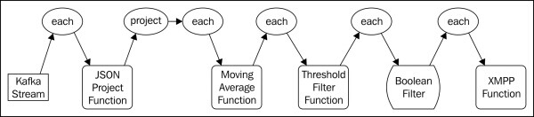

#第四章 实时趋势分析

在这一章,我们将向您介绍趋势分析技术使用Storm和Trident。实时趋势分析涉及到数据流识别模式,如识别当某些事件的发生率或计数达到一定阈值。常见的例子包括在社会媒体中的热门话题,比如在Twitter上当一个特定的标签变得流行或在一个搜索引擎识别热门搜索词。Storm起源于一个在Twitter上进行实时分析数据的项目,并且提供了分析计算所需的许多核心原语。

在前面的章节中,主要是使用Spout实现模拟静态样本数据或使用随机生成的数据。在这一章,我们将介绍一个开源的Spout,发出数据从一个队列(Apache Kafka)并支持所有三种类型的Trdient Spout事务
(Non-transaction，Repeat Transaction和Opaque Transactional)。我们将实现一个简单的,通用的方法来填充Kafka队列使用流行的日志框架,将使您快速实时的开始分析现有的应用程序和数据很少或根本没有源代码修改。

在这一章,我们将讨论下列主题:

- 记录日志数据到Apache Kafka和Storm
- 把现有应用程序的日志数据给Storm进行分析
- 使用Trident实现指数加权移动平均
- 使用storm和XMPP协议发送警报和通知

##用例

在我们的用例中,我们有一个应用程序或一系列应用程序(网站,企业应用程序等等),使用流行的logback框架( http://logback.qos.ch )把结构化的消息记录到磁盘(访问日志、错误等)。目前,对这些数据进行分析的唯一方法是批处理文件使用，例如Hadoop。

引入了这一过程的延迟大大减慢了我们的响应时间;模式从日志数据只出现几小时,有时几天,特定事件发生后,采取响应措施的时机已经过去了。有更可取的模式是当问题出现时立即通知,而不是事后通知。

此用例代表一个共同的主题,并广泛应用在许多业务场景,包括以下应用:
·应用程序监控:例如,通知系统管理员某些网络错误达到一定频率
·入侵检测:例如,检测可疑活动如登录尝试失败增加
·供应链管理:例如,识别特定的销售高峰并及时调整相应交付产品
·在线广告:例如,识别流行趋势和动态改变广告交付

##架构

我们的应用程序的体系结构如下图,描述了它包括的组件:

###源程序

源应用程序组件是任何应用程序使用logback日志框架记录任意的日志消息。对于我们来说,我们将创建
一个简单的应用程序日志结构化的信息在特定的间隔。但是,如您所见,任何现有的应用程序使用logback可以替换为slf4j框架只是一个简单的配置更改。

###logback Kafka appender

logback框架有一个扩展机制,允许您添加额外的输出源配置。一个logback appender只是一个Java
类,接收日志事件并采取相应的措施。最常用的输出源FileAppender是其子类之一,它简单的格式化和记录日志消息写入到磁盘上的文件中。其他appender实现是写日志数据到网络套接字、关系数据库、SMTP电子邮件通知。对于我们的目的,我们将实现一个appender,将日志消息写入一个Apache Kafka队列。

###Apache Kafka

Apache Kafka( http://kafka.apache.org )是一个开源的分布式发布-订阅消息系统。Kafka是专门为高吞吐量设计和优化的持续的实时流系统。像Storm一样,Kafka旨在水平扩展对大的商页软件支持每秒数十万的消息。

###Kafka spout

Kafka spout从Kafka队列中读取数据并发给Storm或者Trident拓扑。Kafka spout最初是由Nathan Marz编写,现在是一个storm-contrib项目的一部分在GitHub( https://github.com/nathanmarz/storm-contrib ）。Kafka spout的预构建二进制文件可从clojars.org Maven存储库( https://clojars.org/storm/storm-kafka )下载。我们将使用Kafka spout从Kafka队列读取消息,流进我们的拓扑。

我们的拓扑结构将由一组内置和定制的Trident组件(功能、过滤器、状态等等),检测模式源数据流。当检测到一个模式,拓扑将发出一个元组给一个函数,将XMPP消息发给XMPP服务器并通知
用户通过一个即时消息(IM)。

###XMPP server

可扩展消息传递和表示协议(XMPP)( http://xmpp.org )是一个基于xml的标准,用于即时消息,消息表示,联系人列表维护的协议。许多IM客户端如Adium(OSX)( http://adium.im )和Pidgin(OSX,Linus,和Windows)( http://www.pidgin.im )支持XMPP协议,如果您曾经使用过Google Talk即时消息,你已经使用XMPP。

我们将使用开放源码的OpenFire XMPP服务器，因其易于设置( http://www.igniterealtime.org/projects/openfire/ )和兼容OSX,Linux和Windows。

## 安装所需软件

我们将开始安装必要的软件:Apache Kafka和OpenFire。虽然Kafka是分布式消息系统,它将工作的很好作为一个节点安装,甚至本地开发环境的一部分。在生产环境中,您需要设置一个一台或多台机器集群根据你的扩展需求。OpenFire服务器不是一个集群系统,可以安装在一个本地或单节点。

###安装Kafka

Kafka依赖于ZooKeeper用于存储特定的状态信息,就像Storm。Storm对ZooKeeper相对轻量,在许多情况下Storm和Kafka可以共享相同的ZooKeeper集群。因为我们已经覆盖了ZooKeeper安装在第二章配置storm集群,在这里我们就介绍本地的ZooKeeper管理服务器,附带Kafka并适合一个开发环境。

首先下载Apache Kafka 的0.7。x版本从以下网站: http://kafka.apache.org/downloads.html

接下来,解压缩源代码包,改变当前的目录为以下目录:

    tar -zxf kafka-0.7.2-incubating-src.tgz
    cd kafka-0.7.2-incubating-src

Kafka是用Scala JVM语言编写的( http://www.scala-lang.org )使用sbt(Scala构建工具)( http://www.scala-sbt.org) 来编译和打包。幸运的是,Kafka下载包包括sbt，可以用下面的命令构建:

    ./sbt update package

启动Kafka之前,除非你已经有了一个ZooKeeper服务运行,否则你将需要启动与Kafka捆绑在一起的ZooKeeper服务，使用以下命令:

   ./bin/zookeeper-server-start.sh ./config/zookeeper.properties

最后,在另一个终端窗口,使用以下命令启动Kafka服务：

    ./bin/kafka-server-start.sh ./config/server.properties

Kafka服务现在可以使用了。

###安装OpenFire

OpenFire可用作为OSX和Windows以及包不同的Linux发行版的安装程序,它可以从以下网站下载: http://www.igniterealtime.org/downloads/index.jsp

安装OpenFire,下载您的操作系统的安装程序需遵循对应的安装说明,可以从以下网站找到:
http://www.igniterealtime.org/builds/openfire/docs/latest/documentation/i
ndex.html

##介绍实例程序

应用程序组件是一个简单的Java类,它使用简单的Java日志Facade(SLF4J)( http://www.slf4j.org )记录日志消息。我们将模拟应用程序首先生成速度相对较慢警告消息,然后切换到一个装填,它生成警告消息以更快的速度,并最终返回到缓慢的状态如下:

- 生成一条警告消息每5秒持续30秒(缓慢的状态)
- 每秒钟生成一个警告消息持续15秒(快速状态)
- 生成一条警告消息每5秒持续30秒(缓慢的状态)

应用程序的目标是生成一个简单的模式,我们的Storm拓扑可以识别和响应通过发送通知当特定模式的事件和状态变化发生,代码片段如以下代码所示:

    public class RogueApplication {
        //private static final Logger LOG =
        //            LoggerFactory.getLogger(RogueApplication.class);
        private static final Logger LOG =
            LoggerFactory.getLogger("com.cjie.storm.trident.trend.RogueApplication");
        public static void main(String[] args) throws Exception {
            int slowCount = 6;
            int fastCount = 15;
            while (true)        {
                // slow state
                for(int i = 0; i < slowCount; i++){
                    LOG.warn("This is a warning (slow state).");
                    Thread.sleep(5000);
                }
                // enter rapid state
                for(int i = 0; i < fastCount; i++){
                    LOG.warn("This is a warning (rapid state).");
                    Thread.sleep(1000);
                }
                // return to slow state
                for(int i = 0; i < slowCount; i++){
                    LOG.warn("This is a warning (slow state).");
                    Thread.sleep(5000);
                }
            }
    
        }
    }

###发送日志消息给Kafka

logback框架提供了一个简单的扩展机制,它允许你插入额外的appender。在我们的例子中,我们要实现一个可以写日志消息数据到Kafka的appender。

Logback包括ch.qos.logback.core。AppenderBase抽象类,使它容易实现Appender接口。
AppenderBase类定义了一个抽象方法如下:

    abstract protected void append(E eventObject);

eventObject参数代表了一个日志记录事件和包括的属性如事件的日期、日志级别(DEBUG, INFO, WARN等等),以及日志消息本身。我们将覆盖append()方法编写eventObject数据到Kafka。

除了append()方法,AppenderBase类定义了两个额外的生命周期方法,我们将需要覆盖：

    public void start();
    public void stop();

start()方法在logback框架初始化期间被调用,stop()方法在deinitialization被调用。我们将会覆盖这些方法来建立和拆除与Kafka的连接服务。

KafkaAppender类的源代码如下:

    public class KafkaAppender extends
            AppenderBase<ILoggingEvent> {
        private String topic;
        private String zookeeperHost;
        private Producer<String, String> producer;
        private Formatter formatter;
    
        // java bean definitions used to inject
        // configuration values from logback.xml
        public String getTopic() {
            return topic;
        }
    
        public void setTopic(String topic) {
            this.topic = topic;
        }
        public String getZookeeperHost() {
            return zookeeperHost;
        }
        public void setZookeeperHost(String zookeeperHost)
        {
            this.zookeeperHost = zookeeperHost;
        }
        public Formatter getFormatter() {
            return formatter;
        }
        public void setFormatter(Formatter formatter) {
            this.formatter = formatter;
        }
        // overrides
        @Override
        public void start() {
            if (this.formatter == null) {
                this.formatter = new MessageFormatter();
            }
            super.start();
            Properties props = new Properties();
            props.put("zk.connect", this.zookeeperHost);
            props.put("serializer.class", "kafka.serializer.StringEncoder");
            ProducerConfig config = new ProducerConfig(props);
            this.producer = new Producer<String, String>(config);
        }
        @Override
        public void stop() {
            super.stop();
            this.producer.close();
        }
        @Override
        protected void append(ILoggingEvent event) {
           String payload = this.formatter.format(event);
           ProducerData<String, String> data = new ProducerData<String, String>(this.topic, payload);
           this.producer.send(data);
        }
        public static void main(String[] args) {
            Properties props = new Properties();
            props.put("zk.connect", "testserver:2181");
            props.put("serializer.class", "kafka.serializer.StringEncoder");
            ProducerConfig config = new ProducerConfig(props);
            Producer producer = new Producer<String, String>(config);
            String payload = String.format("abc%s","test");
            ProducerData<String, String> data = new ProducerData<String, String>("mytopic", payload);
            producer.send(data);
        }
    }

正如您将看到的,JavaBean-style访问器允许我们通过依赖注入配置关联值在运行时当logback框架初始化时。zookeeperHosts属性的setter和getter方法用于初始化KafkaProducer客户机配置来发现kafka在zookeeper注册的主机。另一种方法是提供一个静态Kafka主机列表,但为了简单起见更容易使用一个自动发现机制。主题属性用于告诉KafkaConsumer客户机应该读Kafka的话题。

Formatter属性有点特别。这是我们已经定义的一个接口,它提供了一个扩展点来处理结构(即解析)
日志消息,如下面的代码片段所示:

    public interface Formatter {
        String format(ILoggingEvent event);
    }

Formatter程序实现的工作是把一个ILoggingEvent对象将其转化为机器可读的字符串,可以由消费者处理。下面的代码片段列出的简单实现简单地返回日志消息,丢弃任何额外的元数据:

    public class MessageFormatter implements Formatter {
        public String format(ILoggingEvent event) {
            return event.getFormattedMessage();
        }
    }

以下logback配置文件说明了怎么使用appender。本例中没有定义一个自定义Formatter程序实现,所以KafkaAppender类将默认使用messageformat类和只写日志消息数据到Kafka和丢弃任何额外的信息包含在记录事件,如下面代码片段所示:

    <?xml version="1.0" encoding="UTF-8" ?>
    <configuration>
        <appender name="KAFKA" class="com.github.ptgoetz.logback.kafka.KafkaAppender">
            <topic>mytopic</topic>
            <zookeeperHost>localhost:2181</zookeeperHost>
        </appender>
        <root level="debug">
            <appender-ref ref="KAFKA" />
        </root>
    </configuration>

我们构建的Storm应用是时间敏感的:如果我们跟踪每个事件发生时速率,我们需要精确知道一个事件发生。一个简单的方法是使用System.currentTimeMillis()方法简单地分配每一个事件,当数据进入我们的拓扑时。然而,Trident的批处理机制并不能保证元组将交付给一个拓扑以他们收到的消息同样的速度。

为了解释这种情况,我们需要捕获事件的时间当它发生时,包括它的数据,当我们写到Kafka队列。
幸运的是,ILoggingEvent类包含一个时间戳,以毫秒为单位从纪元以来记录事件发生。

包括元数据包含在ILoggingEvent,我们将创建一个自定义Formatter实现日志事件数据编码的JSON格式如下:

    public class JsonFormatter implements Formatter {
        private static final String QUOTE = "\"";
        private static final String COLON = ":";
        private static final String COMMA = ",";
        private boolean expectJson = false;
    
        public String format(ILoggingEvent event) {
            StringBuilder sb = new StringBuilder();
            sb.append("{");
            fieldName("level", sb);
            quote(event.getLevel().levelStr, sb);
            sb.append(COMMA);
            fieldName("logger", sb);
            quote(event.getLoggerName(), sb);
            sb.append(COMMA);
            fieldName("timestamp", sb);
            sb.append(event.getTimeStamp());
            sb.append(COMMA);
            fieldName("message", sb);
            if (this.expectJson) {
                sb.append(event.getFormattedMessage());
            } else {
                quote(event.getFormattedMessage(), sb);
            }
            sb.append("}");
            return sb.toString();
        }
        private static void fieldName(String name, StringBuilder sb) {
            quote(name, sb);
            sb.append(COLON);
        }
        private static void quote(String value, StringBuilder sb) {
            sb.append(QUOTE);
            sb.append(value);
            sb.append(QUOTE);
        }
        public boolean isExpectJson() {
            return expectJson;
        }
        public void setExpectJson(boolean expectJson) {
            this.expectJson = expectJson;
        }
    }

JsonMessageFormatter类代码的大部分使用一个java.lang.StringBuilder类从ILoggingEvent创建JSON对象。虽然我们可以使用JSON库来做这项工作,我们生成的JSON数据简单并添加一个额外的依赖只是生成JSON，用json库会杀鸡用牛刀了。

JsonMessageFormatter暴漏的一个JavaBean属性是expectJson Boolean用于指定日志消息传递到格式化程序实现是否应被视为JSON。如果设置为False,日志消息将被视为一个字符串用双引号,否则,消息将被视为一个JSON对象数组({…})或([…])。

下面是一个示例logback配置文件,说明了使用KafkaAppender和JsonFormatter类:

    <?xml version="1.0" encoding="UTF-8" ?>
    <configuration>
        <appender name="KAFKA" class="com.cjie.storm.trident.trend.logappender.KafkaAppender">
            <topic>log-analysis</topic>
            <zookeeperHost>testserver:2181</zookeeperHost>
            <formatter class="com.cjie.storm.trident.trend.logappender.JsonFormatter">
                <!--
                Whether we expect the log message to be JSON  encoded or not.
                If set to "false", the log message will be
                treated as a string, and wrapped in quotes. Otherwise
                it will be treated as a parseable JSON object.
                -->
                <expectJson>false</expectJson>
            </formatter>
        </appender>
        <root level="debug">
            <appender-ref ref="KAFKA" />
        </root>
        <logger name="com.cjie.storm.trident.trend.RogueApplication" additivity="false">
            <level value="DEBUG"/>
            <appender-ref ref="KAFKA" />
        </logger>
    </configuration>

因为我们正在构建的拓扑分析是更关心的事件时间而不是消息内容,我们生成的日志消息是字符串,所以
我们设置了expectJson属性为假。

##日志分析拓扑

意味着我们的日志数据写入Kafka,我们准备将注意力转向Trident拓扑的实现进行分析计算。拓扑将执行以下操作:

1. 接收和解析原始JSON日志事件数据。
1. 提取和发射必要的字段。
1. 更新一个指数加权移动平均线的功能。
1. 确定移动平均线交叉指定的阈值。
1. 过滤事件,并不代表一个状态改变(例如移动速率高于/低于阈值)。
2. 发送即时消息(XMPP)通知。

下图描述了拓扑的Trident流操作在顶部和底部流处理组件:

###Kafka spout

创建日志分析拓扑第一步是配置Kafka Spout来处理来自Kafka到我们的拓扑流数据如下:

    TridentTopology topology = new TridentTopology();
    StaticHosts kafkaHosts = KafkaConfig.StaticHosts.fromHostString(Arrays.asList(new String[] { "localhost" }), 1);
    TridentKafkaConfig spoutConf = new TridentKafkaConfig(kafkaHosts, "log-analysis");
    spoutConf.scheme = new StringScheme();
    spoutConf.forceStartOffsetTime(-1);
    OpaqueTridentKafkaSpout spout = new OpaqueTridentKafkaSpout(spoutConf);
    Stream spoutStream = topology.newStream("kafka-stream", spout);

这段代码首先创建一个新的TridentTopology实例,然后使用Kafka Java API来创建一个Kafka主机列表的主机连接(因为我们运行一个单机的、未聚集的Kafka在本地服务,我们指定一个主机:localhost)。接下来,我们创建TridentKafkaConfig对象,通过主机列表和一个惟一的标识符。

我们的应用程序的数据写入Kafka是一个简单的Java字符串,所以我们使用Storm-Kafka内置的StringScheme类。StringScheme类将从Kafka作为字符串读取数据和输出字段命名str的元组。默认情况下,在部署Kafka spout将尝试从Kafka队列读取,最后通过查询ZooKeeper最后的偏移量状态信息。这种行为可以通过调用覆盖TridentKafkaConfig类的forceOffsetTime(long型时间)方法。时间参数可以是以下三个值之一:

- 2(最早偏移):spout将从从一开始就开始阅读队列的数据
- 1(最新偏移):spout将从队列的末尾快进和阅读
- 毫秒为单位:鉴于毫秒(具体日期，例如,java.util.Date.getTime()),Spout将尝试开始阅读从那个时间点

设置spout配置后,我们创建一个不透明TransactionalKafka Spout的实例并建立一个相应的Trident流。

###JSON投影函数

来自Kafka Spout的数据流将包含一个字段(str)从日志事件包含JSON数据。我们将创建一个Trident的功能解析传入的数据和输出,或投影要求的元组字段使用下面的代码片段:

    public class JsonProjectFunction extends BaseFunction {
    
        private Fields fields;
        public JsonProjectFunction(Fields fields) {
            this.fields = fields;
        }
        public void execute(TridentTuple tuple,
                            TridentCollector collector) {
            String json = tuple.getString(0);
            Map<String, Object> map = (Map<String, Object>) JSONValue.parse(json);
            Values values = new Values();
            for (int i = 0; i < this.fields.size(); i++) {
                values.add(map.get(this.fields.get(i)));
            }
            collector.emit(values);
        }
    }

JsonProjectFunction构造函数接受一个字段对象参数,从JSON确定什么值作为关键字发出查找。当函数接收一个元组,它将解析JSON元组的str领域,迭代Fieldsobject的值,并发出相应的值从输入JSON。

下面的代码创建一个字段对象提取字段名称的列表从JSON。然后创建一个新的流对象的spout流,选择str元组字段的输入作为JsonProjectFunction构造函数参数,构造JsonProjectFunction对象,并指定字段选择从JSON也将输出功能:

    Fields jsonFields = new Fields("level", "timestamp", "message", "logger");
    Stream parsedStream = spoutStream.each(new Fields("str"), new JsonProjectFunction(jsonFields), jsonFields);

考虑到从Kafka Spout接收JSON消息:

    {
        "message" : "foo",
        "timestamp" : 1370918376296,
        "level" : "INFO",
        "logger" : "test"
    }
这意味着函数输出元组值如下:
    [INFO, 1370918376296, test, foo]

###计算移动平均数

为了计算日志事件发生的速度,不需要存储大量的状态,我们将实现一个函数,完成统计指数加权移动平均线。

移动平均计算常被用来消除短期波动和长期暴露时间序列数据的趋势。移动平均线一个最常见的例子是使用绘图在股票市场价格的波动,如下截图所示:

移动平均线的平滑效果是通过考虑历史值的计算达到的。移动平均计算执行一个有最少的状态。对于一个时间序列,我们所需要的只保留最后一个事件的时间和最后计算的平均值。

使用伪代码,计算类似于下面的代码片段:

    diff = currentTime - lastEventTime
    currentAverage = (1.0 - alpha) * diff + alpha *lastAverage

前面计算的alpha值是一个恒定的值在0和1之间。alpha值确定过去时间的平滑量。alpha值越接近1,历史价值越能影响当前平均水平。换句话说,一个alpha值接近于0将导致更少的平滑，移动平均将接近当前值。一个alpha值接近1将产生相反的效果。当前平均将受历史波动影响较小,历史值将会有更多的权值决定当前平均水平。

###添加滑动窗口

在某些情况下,我们可能想要折扣历史值减少对移动平均线的影响,例如,如果大量接收事件之间的时间已经过去了重置平滑的效果。在alpha值较低的情况下,这可能不是必要的因为平滑作用很小。,然而在高alpha情况下,它可能是可取的,以抵消平滑效果。

考虑下面的例子。

我们有一个事件(比如网络错误等),很少发生。偶尔,小峰值频率发生,但通常是正常的。所以,我们
想要消除小高峰。如果有什么持续飙升我们才想要收到通知。

如果事件平均一周发生一次(远低于我们的通知阈值),但有一天许多事件在一个小时内上涨(高于我们
通知阈值),高alpha的平滑效应可以抵消飙升,这样永远不会触发通知。

为了抵消这种效应,我们可以将滑动窗口的概念引入到我们的移动平均计算。因为我们已经跟踪最后一个事件和当前平均值,实现一个滑动窗口是简单的，见下面的伪代码:

    if (currentTime - lastEventTime) > slidingWindowInterval
        currentAverage = 0
    end if

指数加权移动平均的一个实现如下所示:

    public class EWMA implements Serializable {
        public static enum Time {
            MILLISECONDS(1),
            SECONDS(1000),
            MINUTES(SECONDS.getTime() * 60),
            HOURS(MINUTES.getTime() * 60),
            DAYS(HOURS.getTime() * 24),
            WEEKS(DAYS.getTime() * 7);
            private long millis;
            private Time(long millis) {
                this.millis = millis;
            }
            public long getTime() {
                return this.millis;
            }
        }
    
        // Unix load average-style alpha constants
        public static final double ONE_MINUTE_ALPHA = 1 - Math.exp(-5d / 60d / 1d);
        public static final double FIVE_MINUTE_ALPHA = 1 - Math.exp(-5d / 60d / 5d);
        public static final double FIFTEEN_MINUTE_ALPHA =  1 - Math.exp(-5d / 60d / 15d);
        private long window;
        private long alphaWindow;
        private long last;
        private double average;
        private double alpha = -1D;
        private boolean sliding = false;
        public EWMA() {
        }
    
        public EWMA sliding(double count, Time time) {
            return this.sliding((long) (time.getTime() * count));
        }
        public EWMA sliding(long window) {
            this.sliding = true;
            this.window = window;
            return this;
        }
    
        public EWMA withAlpha(double alpha) {
            if (!(alpha > 0.0D && alpha <= 1.0D)) {
                throw new IllegalArgumentException("Alpha must be between 0.0 and 1.0");
            }
            this.alpha = alpha;
            return this;
        }
        public EWMA withAlphaWindow(long alphaWindow) {
            this.alpha = -1;
            this.alphaWindow = alphaWindow;
            return this;
        }
    
        public EWMA withAlphaWindow(double count, Time
                time) {
            return this.withAlphaWindow((long) (time.getTime() * count));
        }
        public void mark() {
            mark(System.currentTimeMillis());
        }
    
        public synchronized void mark(long time) {
            if (this.sliding) {
                if (time - this.last > this.window) {
                    // reset the sliding window
                    this.last = 0;
                }
            }
            if (this.last == 0) {
                this.average = 0;
                this.last = time;
            }
            long diff = time - this.last;
            double alpha = this.alpha != -1.0 ? this.alpha :
                    Math.exp(-1.0 * ((double) diff / this.alphaWindow));
            this.average = (1.0 - alpha) * diff + alpha * this.average;
            this.last = time;
        }
        public double getAverage() {
            return this.average;
        }
        public double getAverageIn(Time time) {
            return this.average == 0.0 ? this.average :
                    this.average / time.getTime();
        }
        public double getAverageRatePer(Time time) {
            return this.average == 0.0 ? this.average :
                    time.getTime() / this.average;
        }
    }

EWMA实现定义了三个有用的alpha常量值:ONE_MINUTE_ALPHA，FIVE_MINUTE_ALPHA, FIFTEEN_MINUTE_ALPHA。这些对应于标准的alpha值用来计算平均负载在UNIX中。alpha值也可以手动指定,或作为一个alpha窗口的函数。

实现使用fluent-style构建器API。例如,您可以创建一个EWMA实例实现一分钟的滑动窗口和一个alpha值相当于UNIX一分钟间隔,使用以下代码片段所示:

    EWMA ewma = new EWMA().sliding(1.0, Time.MINUTES).withAlphaEWMA.ONE_MINUTE_ALPHA);

mark()方法用于更新移动平均线。没有参数,mark()方法将使用当前时间来计算平均值。因为我们想使用原始的日志事件的时间戳,覆盖mark()方法允许我们定义一个特定的时间规范。

getAverage()方法返回调用mark()之间的平均时间,以毫秒为单位。我们还增加了方便的getAverageIn()方法,它将返回按指定度量单位的平均时间(秒、分钟、小时等等)。getAverageRatePer()方法返回调用mark()在一个特定的时间测量的速率。

你可能会发现,使用指数加权移动平均线有点棘手。找到合适的组值α以及可选的滑动窗口变化很大取决于具体的用例,找到正确的值主要是尝试和错误的问题。

###实现移动平均函数

使用我们的EWMA类在Trident拓扑中,我们将创建一个名为MovingAverageFunction包装EWMA的一个实例的类，它是Trident BaseFunction抽象类的子类,如下面代码片段所示:

    public class MovingAverageFunction extends
            BaseFunction {
        private static final Logger LOG = LoggerFactory.getLogger(BaseFunction.class);
        private EWMA ewma;
        private EWMA.Time emitRatePer;
        public MovingAverageFunction(EWMA ewma, EWMA.Time emitRatePer){
            this.ewma = ewma;
            this.emitRatePer = emitRatePer;
        }
        public void execute(TridentTuple tuple,
                            TridentCollector collector) {
            this.ewma.mark(tuple.getLong(0));
            LOG.debug("Rate: {}", this.ewma.getAverageRatePer(this.emitRatePer));
            collector.emit(new Values(this.ewma.getAverageRatePer(this.emitRatePer)));
        }
    }