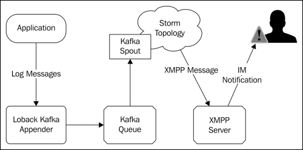

#第四章 实时趋势分析

在这一章,我们将向您介绍趋势分析技术使用Storm和Trident。实时趋势分析涉及到数据流识别模式,如识别当某些事件的发生率或计数达到一定阈值。常见的例子包括在社会媒体中的热门话题,比如在Twitter上当一个特定的标签变得流行或在一个搜索引擎识别热门搜索词。Storm起源于一个在Twitter上进行实时分析数据的项目,并且提供了分析计算所需的许多核心原语。

在前面的章节中,主要是使用Spout实现模拟静态样本数据或使用随机生成的数据。在这一章,我们将介绍一个开源的Spout,发出数据从一个队列(Apache Kafka)并支持所有三种类型的Trdient Spout事务
(Non-transaction，Repeat Transaction和Opaque Transactional)。我们将实现一个简单的,通用的方法来填充Kafka队列使用流行的日志框架,将使您快速实时的开始分析现有的应用程序和数据很少或根本没有源代码修改。

在这一章,我们将讨论下列主题:

- 记录日志数据到Apache Kafka和Storm
- 把现有应用程序的日志数据给Storm进行分析
- 使用Trident实现指数加权移动平均
- 使用storm和XMPP协议发送警报和通知

##用例

在我们的用例中,我们有一个应用程序或一系列应用程序(网站,企业应用程序等等),使用流行的logback框架( http://logback.qos.ch )把结构化的消息记录到磁盘(访问日志、错误等)。目前,对这些数据进行分析的唯一方法是批处理文件使用，例如Hadoop。

引入了这一过程的延迟大大减慢了我们的响应时间;模式从日志数据只出现几小时,有时几天,特定事件发生后,采取响应措施的时机已经过去了。有更可取的模式是当问题出现时立即通知,而不是事后通知。

此用例代表一个共同的主题,并广泛应用在许多业务场景,包括以下应用:
·应用程序监控:例如,通知系统管理员某些网络错误达到一定频率
·入侵检测:例如,检测可疑活动如登录尝试失败增加
·供应链管理:例如,识别特定的销售高峰并及时调整相应交付产品
·在线广告:例如,识别流行趋势和动态改变广告交付

##架构

我们的应用程序的体系结构如下图,描述了它包括的组件:

###源程序

源应用程序组件是任何应用程序使用logback日志框架记录任意的日志消息。对于我们来说,我们将创建
一个简单的应用程序日志结构化的信息在特定的间隔。但是,如您所见,任何现有的应用程序使用logback可以替换为slf4j框架只是一个简单的配置更改。

###logback Kafka appender

logback框架有一个扩展机制,允许您添加额外的输出源配置。一个logback appender只是一个Java
类,接收日志事件并采取相应的措施。最常用的输出源FileAppender是其子类之一,它简单的格式化和记录日志消息写入到磁盘上的文件中。其他appender实现是写日志数据到网络套接字、关系数据库、SMTP电子邮件通知。对于我们的目的,我们将实现一个appender,将日志消息写入一个Apache Kafka队列。

###Apache Kafka

Apache Kafka( http://kafka.apache.org )是一个开源的分布式发布-订阅消息系统。Kafka是专门为高吞吐量设计和优化的持续的实时流系统。像Storm一样,Kafka旨在水平扩展对大的商页软件支持每秒数十万的消息。

###Kafka spout

Kafka spout从Kafka队列中读取数据并发给Storm或者Trident拓扑。Kafka spout最初是由Nathan Marz编写,现在是一个storm-contrib项目的一部分在GitHub( https://github.com/nathanmarz/storm-contrib ）。Kafka spout的预构建二进制文件可从clojars.org Maven存储库( https://clojars.org/storm/storm-kafka )下载。我们将使用Kafka spout从Kafka队列读取消息,流进我们的拓扑。

我们的拓扑结构将由一组内置和定制的Trident组件(功能、过滤器、状态等等),检测模式源数据流。当检测到一个模式,拓扑将发出一个元组给一个函数,将XMPP消息发给XMPP服务器并通知
用户通过一个即时消息(IM)。

###XMPP server

可扩展消息传递和表示协议(XMPP)( http://xmpp.org )是一个基于xml的标准,用于即时消息,消息表示,联系人列表维护的协议。许多IM客户端如Adium(OSX)( http://adium.im )和Pidgin(OSX,Linus,和Windows)( http://www.pidgin.im )支持XMPP协议,如果您曾经使用过Google Talk即时消息,你已经使用XMPP。

我们将使用开放源码的OpenFire XMPP服务器，因其易于设置( http://www.igniterealtime.org/projects/openfire/ )和兼容OSX,Linux和Windows。

## 安装所需软件

我们将开始安装必要的软件:Apache Kafka和OpenFire。虽然Kafka是分布式消息系统,它将工作的很好作为一个节点安装,甚至本地开发环境的一部分。在生产环境中,您需要设置一个一台或多台机器集群根据你的扩展需求。OpenFire服务器不是一个集群系统,可以安装在一个本地或单节点。

###安装Kafka

Kafka依赖于ZooKeeper用于存储特定的状态信息,就像Storm。Storm对ZooKeeper相对轻量,在许多情况下Storm和Kafka可以共享相同的ZooKeeper集群。因为我们已经覆盖了ZooKeeper安装在第二章配置storm集群,在这里我们就介绍本地的ZooKeeper管理服务器,附带Kafka并适合一个开发环境。

首先下载Apache Kafka 的0.7。x版本从以下网站: http://kafka.apache.org/downloads.html

接下来,解压缩源代码包,改变当前的目录为以下目录:

	tar -zxf kafka-0.7.2-incubating-src.tgz
	cd kafka-0.7.2-incubating-src

Kafka是用Scala JVM语言编写的( http://www.scala-lang.org )使用sbt(Scala构建工具)( http://www.scala-sbt.org) 来编译和打包。幸运的是,Kafka下载包包括sbt，可以用下面的命令构建:

	./sbt update package

启动Kafka之前,除非你已经有了一个ZooKeeper服务运行,否则你将需要启动与Kafka捆绑在一起的ZooKeeper服务，使用以下命令:

   ./bin/zookeeper-server-start.sh ./config/zookeeper.properties

最后,在另一个终端窗口,使用以下命令启动Kafka服务：

    ./bin/kafka-server-start.sh ./config/server.properties

卡夫卡服务现在可以使用了。

###安装OpenFire

OpenFire可用作为OSX和Windows以及包不同的Linux发行版的安装程序,它可以从以下网站下载: http://www.igniterealtime.org/downloads/index.jsp

安装OpenFire,下载您的操作系统的安装程序需遵循对应的安装说明,可以从以下网站找到:
http://www.igniterealtime.org/builds/openfire/docs/latest/documentation/i
ndex.html